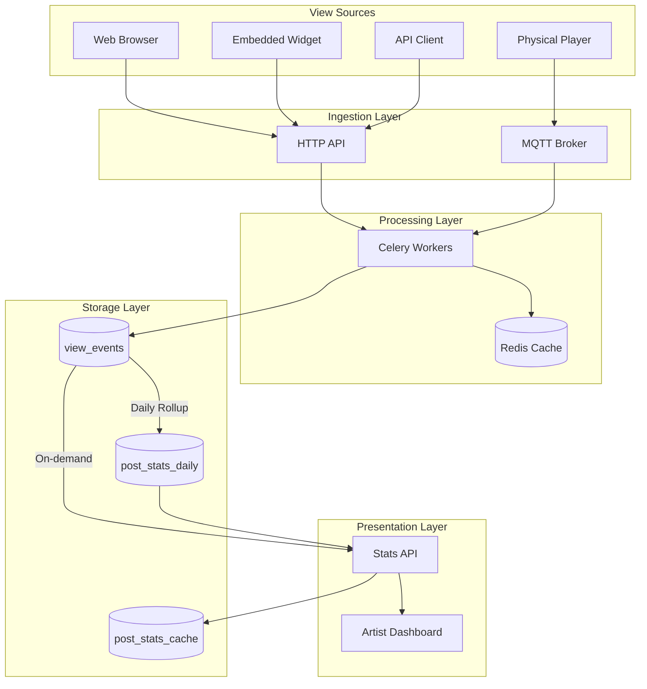

# View Tracking System (VTS)

The **View Tracking System (VTS)** is a core subsystem of the Artist Recognition Platform (ARP) responsible for capturing, storing, processing, and presenting detailed telemetry about artwork views on Makapix Club.

## Overview

The VTS tracks every meaningful interaction with artworks across all platforms:

- **Web browsers** (desktop, mobile, tablet)
- **Physical player devices** (p3a and others) via MQTT
- **Embedded widgets** on third-party sites
- **API consumers**

Each view event captures rich contextual information enabling artists to understand their audience's behavior, geographic distribution, and engagement patterns.

## Key Capabilities

| Capability | Description |
|------------|-------------|
| **Multi-source capture** | Unified tracking across web, API, widgets, and physical players |
| **Device classification** | Desktop, mobile, tablet, and player device detection |
| **Intent classification** | Distinguishes direct clicks from automated/playlist views |
| **Channel context** | Tracks what channel (all, promoted, user, hashtag) was playing |
| **Geographic data** | Country-level resolution via GeoIP lookup |
| **Privacy-preserving** | IP addresses are hashed; no PII stored |
| **Async processing** | Non-blocking view recording via Celery task queue |
| **Aggregation** | Daily rollups for long-term storage efficiency |
| **Rate limiting** | Prevents abuse from players (1 view per 5 seconds) |
| **Deduplication** | Handles MQTT QoS retransmissions gracefully |

## Documentation Structure

| Document | Description |
|----------|-------------|
| [Data Model](./data-model.md) | Database schema, tables, and data structures |
| [Data Flow](./data-flow.md) | End-to-end flow of view events with diagrams |
| [Sources and Channels](./sources-and-channels.md) | View sources, device types, and channel contexts |
| [Aggregation and Statistics](./aggregation-and-stats.md) | Daily rollups, caching, and stats computation |
| [Player Integration](./player-integration.md) | MQTT-based view reporting from physical players |
| [Known Issues](./known-issues.md) | Current limitations and areas for improvement |

## Quick Architecture Overview

## View Event Lifecycle

1. **Capture** — View is detected (page load, MQTT message, widget impression)
2. **Enrich** — Device type, country code, referrer extracted
3. **Queue** — Event data serialized and sent to Celery
4. **Write** — Async worker persists to `view_events` table
5. **Aggregate** — Daily task rolls up events older than 7 days
6. **Query** — Statistics computed on-demand with Redis caching
7. **Present** — Data displayed in Stats Panel and Artist Dashboard

## Related Systems

- **Site Metrics System** — Tracks page views at the site level (separate from artwork views)
- **Blog Post View Tracking** — Parallel system for blog post analytics *(POSTPONED: Blog posts deferred to later date)*
- **Player Command System** — Handles other player interactions (reactions, comments)

---

*Last updated: December 2025*

