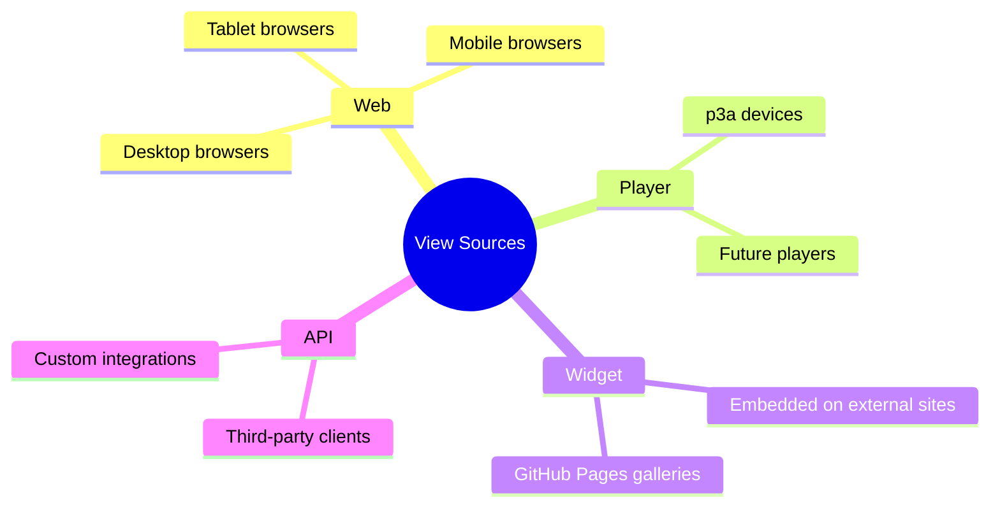
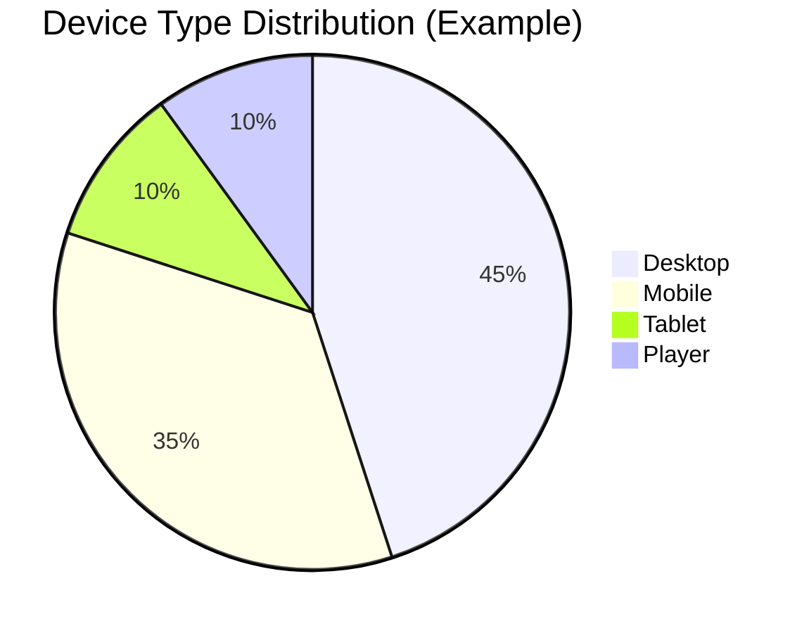
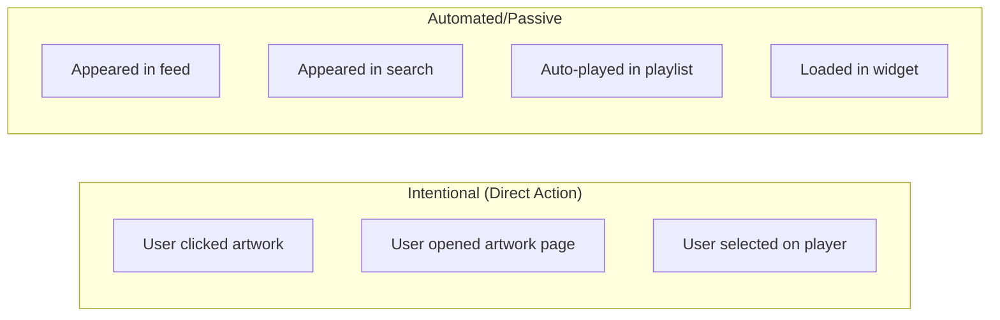
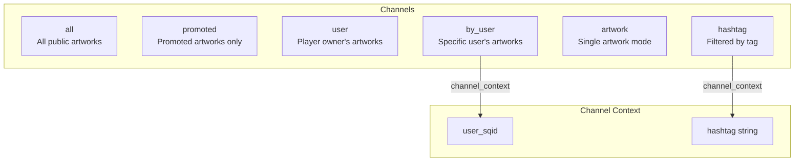
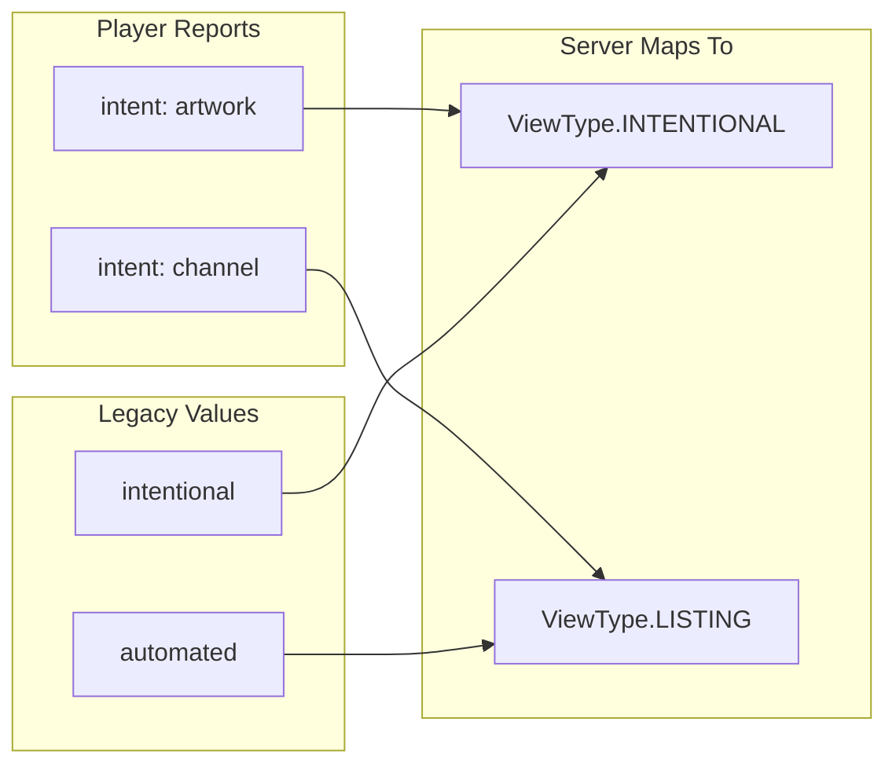
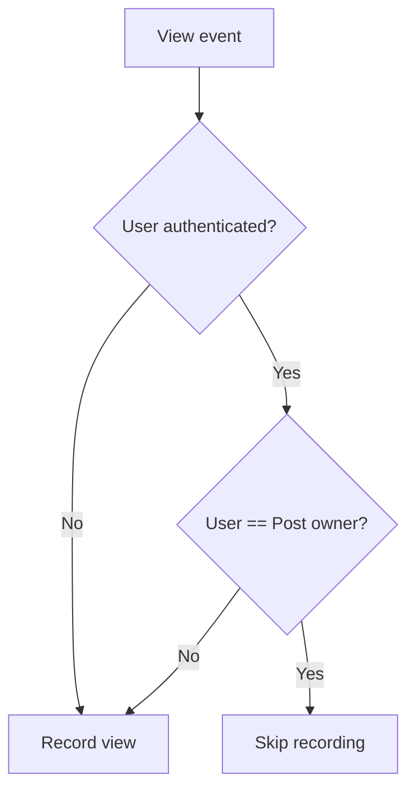

# Sources and Channels

This document describes the various sources from which view events can originate and the channel/intent classification system.

> **⚠️ FEATURE POSTPONED: Blog Posts**
> 
> As of December 2025, blog post functionality has been postponed to an indeterminate future date.
> This document currently covers view tracking for artwork only. Blog post view tracking is implemented
> but not exposed to users until the feature is reactivated.

## View Sources

Views can originate from four distinct sources:



### Source: Web

Views from the Makapix Club website, accessed through standard web browsers.

| Aspect | Details |
|--------|---------|
| **Protocol** | HTTPS |
| **Detection** | Default source for HTTP API requests |
| **Device types** | Desktop, mobile, tablet |
| **Auth** | Optional (supports anonymous) |
| **Metadata** | Full (IP, user agent, referer, country) |

### Source: Player

Views from physical Makapix player devices (p3a and others) connected via MQTT.

| Aspect | Details |
|--------|---------|
| **Protocol** | MQTT over TLS |
| **Detection** | Source is always `player` for MQTT views |
| **Device type** | Always `player` |
| **Auth** | Required (player registration) |
| **Metadata** | Partial (no country, includes channel context) |
| **Rate limit** | 1 view per 5 seconds per device |

### Source: Widget

Views from embedded Makapix widgets on third-party websites.

| Aspect | Details |
|--------|---------|
| **Protocol** | HTTPS (cross-origin) |
| **Detection** | Special widget API endpoints |
| **Device types** | Desktop, mobile, tablet |
| **Auth** | Optional |
| **Metadata** | Full + referrer domain tracking |

### Source: API

Views from custom API integrations and third-party clients.

| Aspect | Details |
|--------|---------|
| **Protocol** | HTTPS |
| **Detection** | Based on API endpoint and user agent |
| **Device types** | Inferred from user agent |
| **Auth** | Varies by endpoint |
| **Metadata** | Full |

## Device Types



### Detection Algorithm

Device type is detected from the `User-Agent` header using regex pattern matching:

```
function detect_device_type(user_agent):
    if matches(PLAYER_PATTERNS):    // "Makapix-Player", "PixelFrame", "Divoom"
        return PLAYER
    
    if matches(TABLET_PATTERNS):    // "iPad", "Android" (without "Mobile")
        return TABLET
    
    if matches(MOBILE_PATTERNS):    // "iPhone", "Android.*Mobile", etc.
        return MOBILE
    
    return DESKTOP                   // Default
```

### Player Detection Patterns

Physical player devices are identified by custom User-Agent strings:

- `Makapix-Player/*`
- `PixelFrame/*`
- `Divoom/*`

### Mobile Detection Patterns

| Pattern | Examples |
|---------|----------|
| `iPhone` | Safari on iPhone |
| `iPod` | Safari on iPod Touch |
| `Android.*Mobile` | Chrome on Android phone |
| `Mobile.*Safari` | Generic mobile Safari |
| `webOS` | Palm/LG webOS |
| `BlackBerry` | BlackBerry browser |
| `Opera Mini/Mobi` | Opera Mobile |
| `IEMobile` | Internet Explorer Mobile |
| `Windows Phone` | Windows Phone browser |

### Tablet Detection Patterns

| Pattern | Examples |
|---------|----------|
| `iPad` | Safari on iPad |
| `Android` (without `Mobile`) | Chrome on Android tablet |
| `Tablet` | Generic tablet UA |
| `PlayBook` | BlackBerry PlayBook |
| `Silk` | Amazon Silk browser |
| `Kindle` | Kindle browser |

## View Types (Intent Classification)

View type indicates **how** the user encountered the artwork:



### Type: Intentional

The user explicitly chose to view this artwork.

| Trigger | Example |
|---------|---------|
| Click on artwork card | User clicks thumbnail in gallery |
| Direct URL navigation | User visits `/p/{sqid}` directly |
| Player artwork selection | User presses button to view specific artwork |

### Type: Listing

The artwork appeared as part of a list or feed.

| Trigger | Example |
|---------|---------|
| Feed scroll | Artwork visible in "Recent Artworks" |
| Profile gallery | Artwork visible on artist's profile |
| Channel playback | Auto-playing in player channel |

### Type: Search

The artwork appeared in search results.

| Trigger | Example |
|---------|---------|
| Search results | Artwork matches search query |
| Hashtag browse | Artwork appears in hashtag listing |

### Type: Widget

The artwork was viewed through an embedded widget.

| Trigger | Example |
|---------|---------|
| GitHub Pages embed | Artwork in artist's GitHub gallery |
| Third-party embed | Widget on external blog |

## Player Channels

Physical player devices track the **channel** being played when a view occurs:



### Channel: all

All publicly visible artworks from all users.

### Channel: promoted

Only artworks that have been promoted (frontpage, editor-pick, weekly-pack).

### Channel: user

The player owner's own artworks.

### Channel: by_user

A specific user's artworks. Requires `channel_context` containing the target user's `public_sqid`.

### Channel: artwork

Single artwork mode (no automatic advancement).

### Channel: hashtag

Artworks filtered by a specific hashtag. Requires `channel_context` containing the hashtag (without `#`).

## Play Order Modes

Players can use different ordering strategies:

| Mode | Value | Description |
|------|-------|-------------|
| Server | `0` | Default server ordering (by ID/insertion) |
| Created | `1` | Chronological by creation date |
| Random | `2` | Randomized order (with optional seed) |

## Intent Mapping (Player)

Players report intent as either `artwork` or `channel`:



The server accepts both old (`intentional`/`automated`) and new (`artwork`/`channel`) intent values for backward compatibility.

## Author View Exclusion

Views by the artwork's owner are **excluded** from tracking:



This ensures artists don't inflate their own view counts.

## Geographic Data

Country codes are resolved via GeoIP lookup from the viewer's IP address:

- Uses MaxMind GeoLite2 database
- Returns ISO 3166-1 alpha-2 codes (e.g., `US`, `BR`, `JP`)
- Falls back to `null` if lookup fails
- Not available for player views (players don't expose IP)

### Top Countries Display

The stats UI shows the top 10 countries by view count with:
- Country flag emoji (derived from code)
- Full country name mapping
- View count and relative bar chart

---

*See also: [Player Integration](./player-integration.md) for MQTT protocol details*

