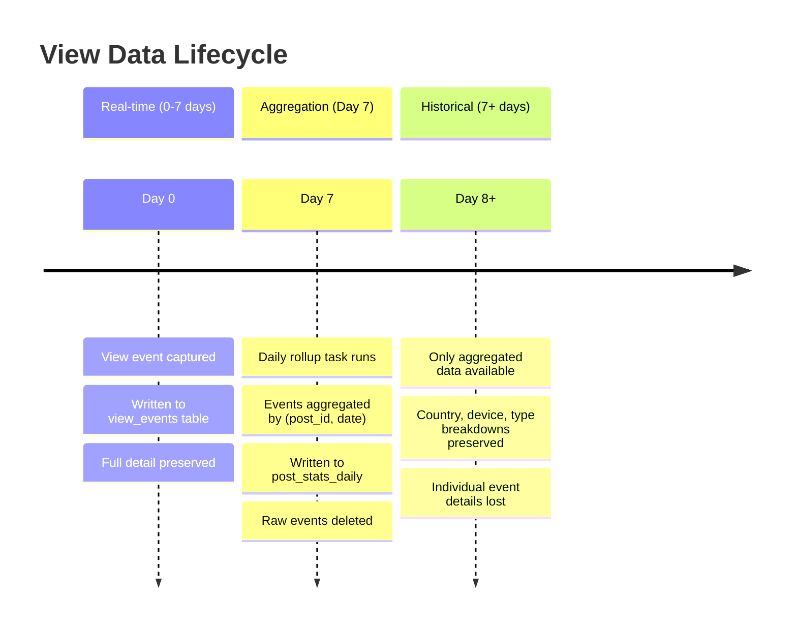
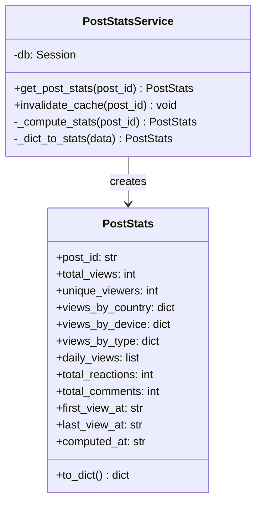
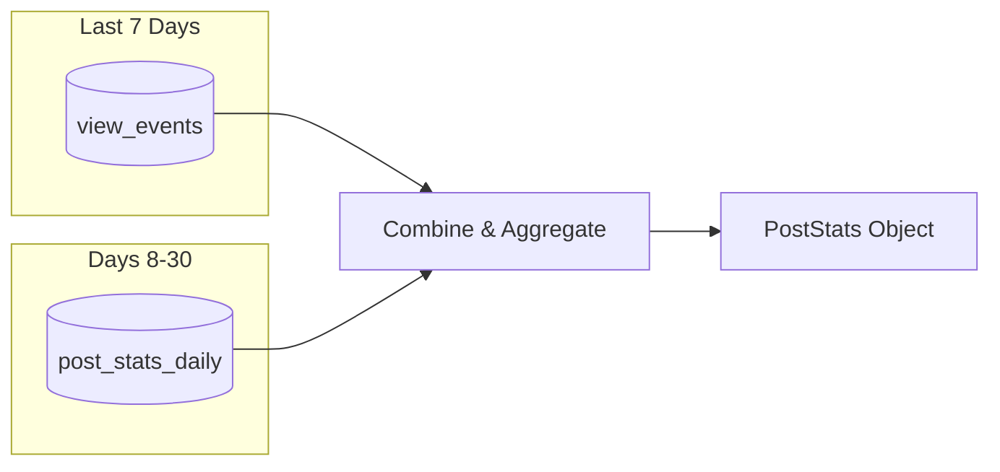
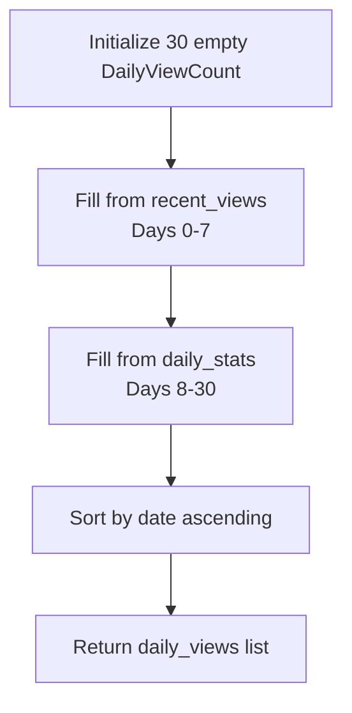
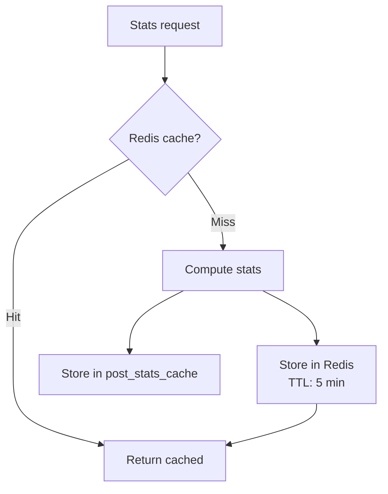
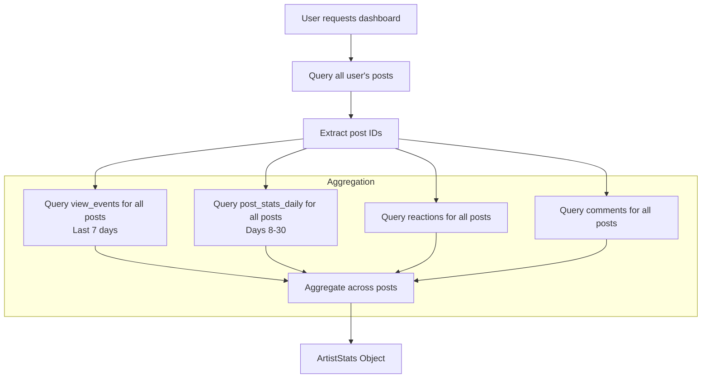

# Aggregation and Statistics

This document describes how view data is aggregated, cached, and computed for presentation.

## Data Lifecycle



## Daily Rollup Process

### Schedule

The rollup task runs daily via Celery Beat:

```
beat_schedule:
  rollup-view-events:
    task: app.tasks.rollup_view_events
    schedule: 86400.0  # Every 24 hours
```

### Algorithm

```mermaid
flowchart TD
    START[Start rollup task]
    
    START --> CUTOFF[cutoff = now - 7 days]
    CUTOFF --> COUNT[Count events before cutoff]
    
    COUNT --> EMPTY{count == 0?}
    EMPTY -->|Yes| DONE[Done]
    
    EMPTY -->|No| INIT[Initialize aggregates map]
    
    INIT --> BATCH[Fetch batch of 10,000 events]
    
    BATCH --> LOOP{More events?}
    LOOP -->|No| WRITE[Write aggregates to DB]
    
    LOOP -->|Yes| PROCESS[Process each event]
    
    subgraph "Process Event"
        PROCESS --> KEY[key = (post_id, date)]
        KEY --> INCR[total_views++]
        INCR --> UNIQUE[Add IP hash to set]
        UNIQUE --> COUNTRY[views_by_country[code]++]
        COUNTRY --> DEVICE[views_by_device[type]++]
        DEVICE --> TYPE[views_by_type[vtype]++]
    end
    
    TYPE --> NEXT[Next batch]
    NEXT --> BATCH
    
    WRITE --> DELETE[DELETE FROM view_events<br/>WHERE created_at < cutoff]
    DELETE --> DONE
```

### Batch Processing

Events are processed in batches of 10,000 to prevent memory exhaustion:

```
BATCH_SIZE = 10000

while offset < total_count:
    batch = query(ViewEvent)
        .filter(created_at < cutoff)
        .offset(offset)
        .limit(BATCH_SIZE)
        .all()
    
    for event in batch:
        aggregate(event)
    
    db.expire_all()  # Free memory
    offset += BATCH_SIZE
```

### Aggregation Structure

For each `(post_id, date)` key, the following is aggregated:

| Field | Type | Aggregation |
|-------|------|-------------|
| `total_views` | int | Sum of events |
| `unique_viewers` | int | Count of distinct `viewer_ip_hash` |
| `views_by_country` | map | Counts by `country_code` |
| `views_by_device` | map | Counts by `device_type` |
| `views_by_type` | map | Counts by `view_type` |

### Upsert Logic

If a daily record already exists (e.g., from a previous partial run), it's merged:

```
if existing_record:
    existing.total_views += new.total_views
    existing.unique_viewers += new.unique_viewers  # Approximate
    merge_maps(existing.views_by_country, new.views_by_country)
    merge_maps(existing.views_by_device, new.views_by_device)
    merge_maps(existing.views_by_type, new.views_by_type)
else:
    insert(new_record)
```

> **Note:** Unique viewer count is an approximation when merging, as we cannot deduplicate IP hashes across aggregated data.

## Statistics Computation

### Service Architecture



### Query Strategy

Statistics are computed by combining two data sources:



### 30-Day Window

```
now = datetime.now(UTC)
seven_days_ago = now - timedelta(days=7)
thirty_days_ago = now - timedelta(days=30)

# Recent raw events (full detail)
recent_views = query(ViewEvent)
    .filter(post_id == target, created_at >= seven_days_ago)
    .all()

# Historical aggregates
daily_stats = query(PostStatsDaily)
    .filter(post_id == target, date >= thirty_days_ago, date < seven_days_ago)
    .all()
```

### All vs. Authenticated Statistics

The stats service computes two sets of statistics:

| Category | Description | Data Source |
|----------|-------------|-------------|
| **All** | Includes anonymous views | Full 30 days (raw + aggregated) |
| **Authenticated** | Only logged-in users | Last 7 days only* |

> *Note: `post_stats_daily` does not separate authenticated/unauthenticated views, so authenticated-only stats are limited to the 7-day raw event window.

### Daily Trend Computation



## Caching Strategy

### Two-Layer Cache



### Redis Cache

| Aspect | Value |
|--------|-------|
| Key format | `post_stats:{post_id}` |
| TTL | 300 seconds (5 minutes) |
| Serialization | JSON |
| Eviction | TTL expiration |

### Database Cache

The `post_stats_cache` table provides persistence across Redis restarts:

| Column | Purpose |
|--------|---------|
| `stats_json` | Serialized PostStats object |
| `computed_at` | When stats were computed |
| `expires_at` | When cache should be considered stale |

### Cache Cleanup

Expired cache entries are cleaned hourly:

```
beat_schedule:
  cleanup-expired-stats-cache:
    task: app.tasks.cleanup_expired_stats_cache
    schedule: 3600.0  # Every hour
```

## Artist Dashboard Aggregation

The Artist Dashboard computes aggregate statistics across all of an artist's posts:



### ArtistStats Fields

```
ArtistStats:
  user_id: int
  user_key: str
  total_posts: int
  
  # Aggregated view statistics (all)
  total_views: int
  unique_viewers: int
  views_by_country: dict  # Top 10
  views_by_device: dict
  
  # Aggregated reactions and comments
  total_reactions: int
  reactions_by_emoji: dict
  total_comments: int
  
  # Authenticated-only (same structure)
  total_views_authenticated: int
  ...
  
  # Timestamps
  first_post_at: str
  latest_post_at: str
  computed_at: str
```

## Performance Considerations

### Query Optimization

| Query | Index Used |
|-------|-----------|
| Recent views by post | `ix_view_events_post_created` |
| Daily stats by post | `ix_post_stats_daily_post_date` |
| Views by player | `ix_view_events_player_id` |
| Views by channel | `ix_view_events_channel` |

### Batched Aggregation

- Rollup processes 10,000 events per batch
- Commits every 1,000 upserts
- Uses `db.expire_all()` to free SQLAlchemy identity map

### Cache Effectiveness

Typical cache hit rates:

| Scenario | Expected Hit Rate |
|----------|-------------------|
| Popular artwork viewed multiple times | 90%+ |
| Artist checking own stats | 70%+ |
| Long-tail artwork | 30-50% |

## Scheduled Tasks Summary

| Task | Schedule | Purpose |
|------|----------|---------|
| `rollup_view_events` | Daily | Aggregate 7+ day old events |
| `cleanup_old_view_events` | Daily | Safety net for straggler events |
| `cleanup_expired_stats_cache` | Hourly | Remove expired DB cache entries |

---

*See also: [Data Model](./data-model.md) for schema details*

