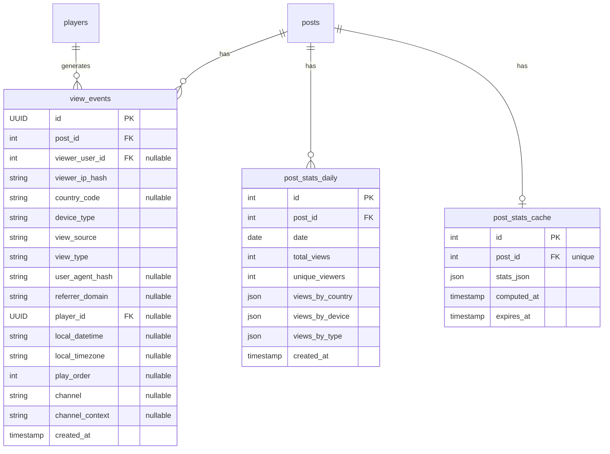

# VTS Data Model

This document describes the database schema and data structures used by the View Tracking System.

## Database Tables

The VTS uses three primary tables for view tracking data:



## Table: `view_events`

Raw view events with full metadata. Retained for **7 days** before aggregation.

| Column | Type | Description |
|--------|------|-------------|
| `id` | UUID | Primary key |
| `post_id` | Integer | Foreign key to `posts.id` |
| `viewer_user_id` | Integer | Foreign key to `users.id` (null for anonymous) |
| `viewer_ip_hash` | String(64) | SHA256 hash of viewer's IP address |
| `country_code` | String(2) | ISO 3166-1 alpha-2 country code (e.g., "US", "BR") |
| `device_type` | String(20) | One of: `desktop`, `mobile`, `tablet`, `player` |
| `view_source` | String(20) | One of: `web`, `api`, `widget`, `player` |
| `view_type` | String(20) | One of: `intentional`, `listing`, `search`, `widget` |
| `user_agent_hash` | String(64) | SHA256 hash for device fingerprinting |
| `referrer_domain` | String(255) | Extracted domain from Referer header |
| `player_id` | UUID | Foreign key to `players.id` (player views only) |
| `local_datetime` | String(50) | Player's local datetime in ISO 8601 format |
| `local_timezone` | String(50) | Player's IANA timezone identifier |
| `play_order` | Integer | Play order mode: 0=server, 1=created_at, 2=random |
| `channel` | String(20) | Channel being played: `all`, `promoted`, `user`, `by_user`, `artwork`, `hashtag` |
| `channel_context` | String(100) | Context for channel (user_sqid for `by_user`, hashtag for `hashtag`) |
| `created_at` | Timestamp | Event timestamp (server time, UTC) |

### Indexes

- `ix_view_events_post_created` — Composite index on `(post_id, created_at DESC)`
- `ix_view_events_player_id` — Index on `player_id`
- `ix_view_events_channel` — Index on `channel`

## Table: `post_stats_daily`

Aggregated daily statistics. **Permanent storage** for historical data.

| Column | Type | Description |
|--------|------|-------------|
| `id` | Integer | Primary key |
| `post_id` | Integer | Foreign key to `posts.id` |
| `date` | Date | Aggregation date |
| `total_views` | Integer | Total views on this date |
| `unique_viewers` | Integer | Count of unique viewer IP hashes |
| `views_by_country` | JSON | Map of country code → count |
| `views_by_device` | JSON | Map of device type → count |
| `views_by_type` | JSON | Map of view type → count |
| `created_at` | Timestamp | Row creation timestamp |

### Constraints

- Unique constraint on `(post_id, date)`

## Table: `post_stats_cache`

Cached computed statistics. **Expires after 5 minutes**.

| Column | Type | Description |
|--------|------|-------------|
| `id` | Integer | Primary key |
| `post_id` | Integer | Foreign key to `posts.id` (unique) |
| `stats_json` | JSON | Complete computed statistics object |
| `computed_at` | Timestamp | When stats were computed |
| `expires_at` | Timestamp | Cache expiration time |

## In-Memory Data Structures

### PostStats

The primary statistics object returned by the stats API:

```
PostStats:
  post_id: string
  
  # All views (including unauthenticated)
  total_views: int
  unique_viewers: int
  views_by_country: map[string, int]   # Top 10 countries
  views_by_device: map[string, int]    # desktop, mobile, tablet, player
  views_by_type: map[string, int]      # intentional, listing, search, widget
  daily_views: list[DailyViewCount]    # Last 30 days
  total_reactions: int
  reactions_by_emoji: map[string, int]
  total_comments: int
  
  # Authenticated-only views
  total_views_authenticated: int
  unique_viewers_authenticated: int
  views_by_country_authenticated: map[string, int]
  views_by_device_authenticated: map[string, int]
  views_by_type_authenticated: map[string, int]
  daily_views_authenticated: list[DailyViewCount]
  total_reactions_authenticated: int
  reactions_by_emoji_authenticated: map[string, int]
  total_comments_authenticated: int
  
  # Timestamps
  first_view_at: string | null   # ISO datetime
  last_view_at: string | null    # ISO datetime
  computed_at: string            # ISO datetime
```

### DailyViewCount

```
DailyViewCount:
  date: string        # ISO date (YYYY-MM-DD)
  views: int          # Total views
  unique_viewers: int # Unique viewer count
```

### ViewEvent (Celery task payload)

```
event_data:
  post_id: string
  viewer_user_id: string | null
  viewer_ip_hash: string
  country_code: string | null
  device_type: string
  view_source: string
  view_type: string
  user_agent_hash: string | null
  referrer_domain: string | null
  created_at: string  # ISO datetime
  
  # Player-specific fields (optional)
  player_id: string | null
  local_datetime: string | null
  local_timezone: string | null
  play_order: int | null
  channel: string | null
  channel_context: string | null
```

## Enumerations

### DeviceType

| Value | Description |
|-------|-------------|
| `desktop` | Desktop/laptop browser |
| `mobile` | Mobile phone browser |
| `tablet` | Tablet browser (iPad, Android tablet) |
| `player` | Physical Makapix player device |

### ViewSource

| Value | Description |
|-------|-------------|
| `web` | Direct website access |
| `api` | API client access |
| `widget` | Embedded widget on third-party site |
| `player` | Physical player device |

### ViewType

| Value | Description |
|-------|-------------|
| `intentional` | User clicked to view (direct action) |
| `listing` | Appeared in feed/list (automated) |
| `search` | Appeared in search results |
| `widget` | Viewed via embedded widget |

### Channel (Player-specific)

| Value | Description |
|-------|-------------|
| `all` | All artworks channel |
| `promoted` | Promoted artworks only |
| `user` | Player owner's artworks |
| `by_user` | Specific user's artworks |
| `artwork` | Single artwork mode |
| `hashtag` | Filtered by hashtag |

## Data Retention

| Data Type | Retention Period | Notes |
|-----------|------------------|-------|
| Raw view events | 7 days | Rolled up then deleted |
| Daily aggregates | Permanent | Space-efficient long-term storage |
| Stats cache | 5 minutes | Redis + database cache |
| Rate limit keys | 5 seconds | Redis TTL |
| Deduplication keys | 60 seconds | Redis TTL |

## Privacy Considerations

- **IP addresses** are hashed with SHA256 before storage
- **User agents** are hashed for device fingerprinting
- **No PII** is stored in view events
- **Authenticated user IDs** are stored for segmentation but not exposed in stats UI by default

---

*See also: [Data Flow](./data-flow.md) for how data moves through the system*

