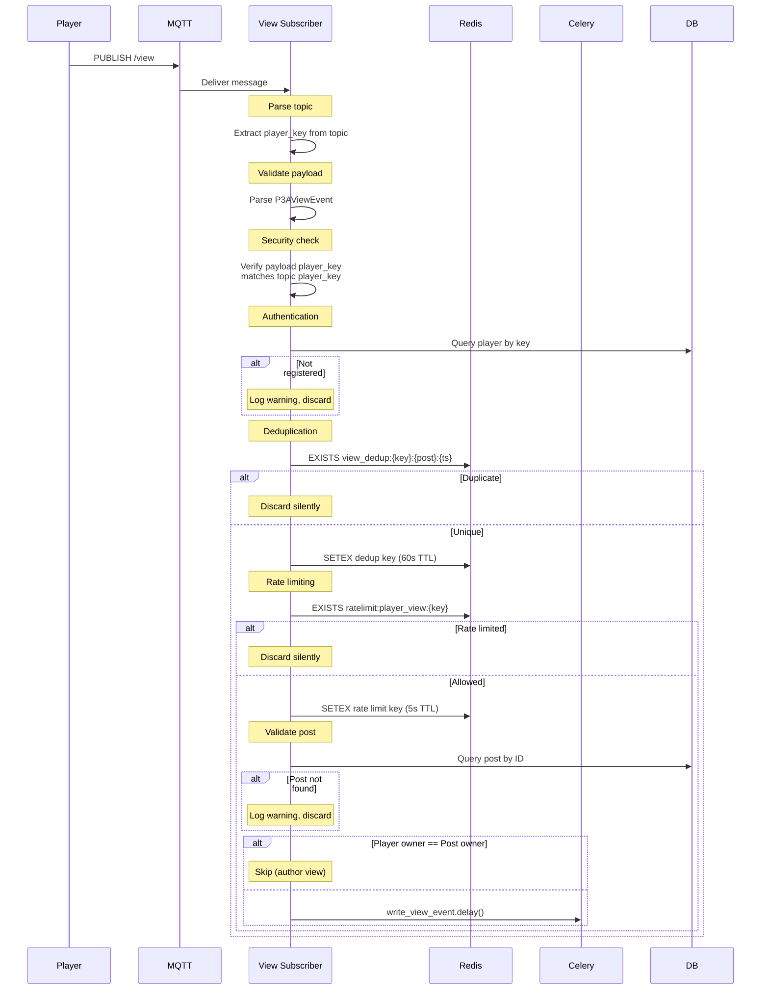
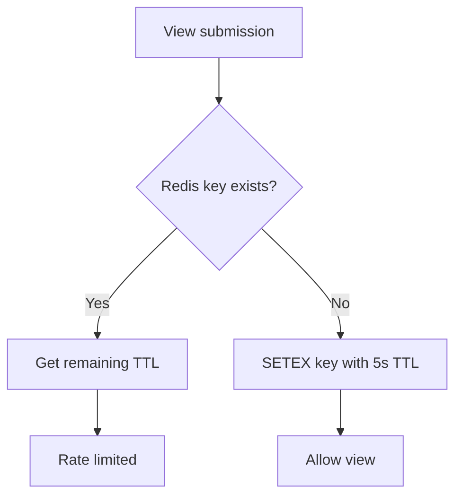
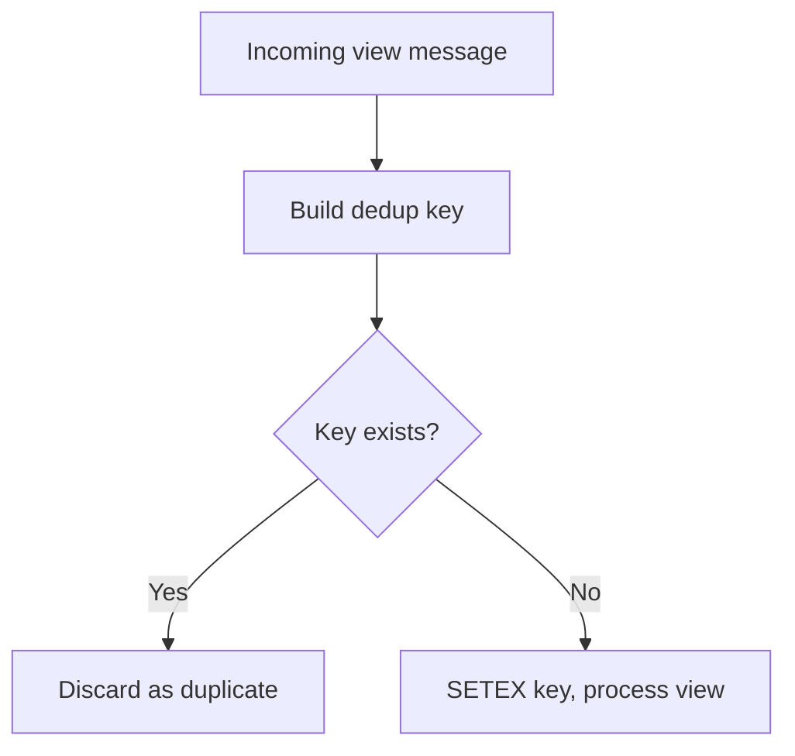
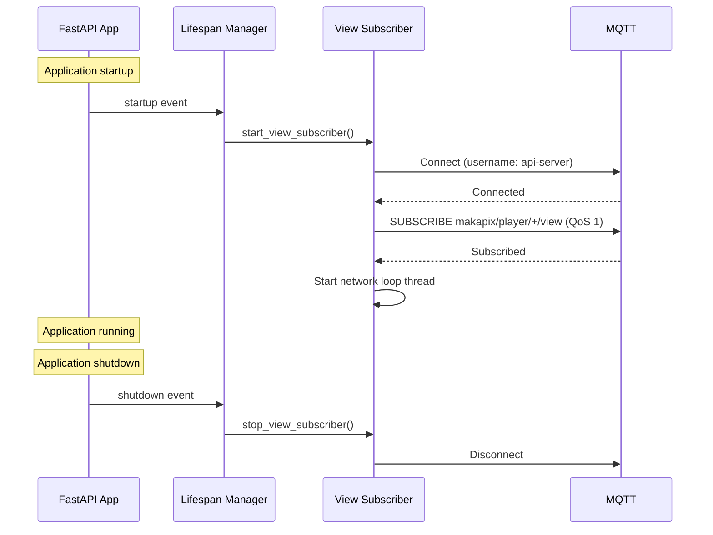

# Player Integration

This document describes how physical Makapix player devices (p3a and others) report view events via the MQTT backend.

## Overview

Players report views through two MQTT patterns:

```mermaid
flowchart TB
    subgraph "Request/Response Pattern"
        P1[Player] -->|PUBLISH| REQ[makapix/player/{key}/request/{req_id}]
        REQ --> SRV1[API Server]
        SRV1 -->|PUBLISH| RESP[makapix/player/{key}/response/{req_id}]
        RESP --> P1
    end
    
    subgraph "Fire-and-Forget Pattern"
        P2[Player] -->|PUBLISH| VIEW[makapix/player/{key}/view]
        VIEW --> SRV2[API Server]
        Note1[No response]
    end
```

## Pattern 1: Request/Response

Used by players that expect acknowledgment or need error handling.

### Topic Structure

```
Request:  makapix/player/{player_key}/request/{request_id}
Response: makapix/player/{player_key}/response/{request_id}
```

### Request Payload

```json
{
  "request_id": "req_12345",
  "request_type": "submit_view",
  "player_key": "550e8400-e29b-41d4-a716-446655440000",
  "post_id": 42,
  "view_intent": "channel",
  "local_datetime": "2025-12-22T14:30:00-05:00",
  "local_timezone": "America/New_York",
  "play_order": 2,
  "channel": "hashtag",
  "channel_hashtag": "pixelart"
}
```

### Success Response

```json
{
  "request_id": "req_12345",
  "success": true,
  "error": null,
  "error_code": null,
  "retry_after": null
}
```

### Rate Limited Response

```json
{
  "request_id": "req_12346",
  "success": false,
  "error": "Rate limit exceeded. Players can submit 1 view per 5 seconds.",
  "error_code": "rate_limited",
  "retry_after": 3.2
}
```

### Request Schema

| Field | Type | Required | Description |
|-------|------|----------|-------------|
| `request_id` | string | Yes | Unique correlation ID |
| `request_type` | string | Yes | Must be `submit_view` |
| `player_key` | UUID | Yes | Player's unique key |
| `post_id` | int | Yes | Artwork being viewed |
| `view_intent` | string | No | `channel` (automated) or `artwork` (intentional) |
| `local_datetime` | string | No | ISO 8601 with timezone |
| `local_timezone` | string | No | IANA timezone identifier |
| `play_order` | int | No | 0=server, 1=created, 2=random |
| `channel` | string | No | Active channel |
| `channel_user_sqid` | string | No | User sqid for `by_user` channel |
| `channel_hashtag` | string | No | Hashtag for `hashtag` channel |

## Pattern 2: Fire-and-Forget

Used by p3a devices for efficient, low-overhead view reporting.

### Topic Structure

```
makapix/player/{player_key}/view
```

- **QoS:** 1 (at least once delivery)
- **Retained:** No
- **Response:** None expected

### Payload Format

```json
{
  "post_id": 192,
  "timestamp": "2025-12-22T16:24:15Z",
  "timezone": "",
  "intent": "channel",
  "play_order": 2,
  "channel": "all",
  "player_key": "a1b2c3d4-e5f6-7890-abcd-ef1234567890"
}
```

### Field Mapping

| p3a Field | Server Field | Notes |
|-----------|--------------|-------|
| `post_id` | `post_id` | Direct mapping |
| `timestamp` | `local_datetime` | Stored as-is; NULL if unsynced |
| `timezone` | `local_timezone` | Currently empty from p3a |
| `intent` | `view_type` | `artwork` → intentional, `channel` → listing |
| `play_order` | `play_order` | Direct mapping (0-2) |
| `channel` | `channel` | Direct mapping |
| `player_key` | `player_id` | Validated against topic |

### Unsynced Device Time

When p3a hasn't synced its clock, it sends `"1970-01-01T00:00:00Z"`:

```mermaid
flowchart TD
    TS[timestamp field]
    TS --> CHECK{== "1970-01-01T00:00:00Z"?}
    CHECK -->|Yes| NULL[Store NULL for local_datetime]
    CHECK -->|No| STORE[Store timestamp as-is]
    NULL --> SERVER[Use server's created_at for ordering]
```

## MQTT ACL Configuration

```
# Player can write to their own view topic
pattern write makapix/player/%u/view

# API server can read all player view topics
user api-server
topic read makapix/player/+/view

# API server can read/write request/response topics
topic read makapix/player/+/request/+
topic write makapix/player/+/response/+
```

## Processing Pipeline



## Rate Limiting

### Policy

- **Limit:** 1 view per 5 seconds per player (global, not per-artwork)
- **Scope:** Per player_key
- **Implementation:** Redis SETEX with 5-second TTL

### Redis Key

```
ratelimit:player_view:{player_key}
```

### Behavior

| Pattern | On Rate Limit |
|---------|---------------|
| Request/Response | Return error with `retry_after` |
| Fire-and-Forget | Discard silently (logged at DEBUG) |



## Deduplication

MQTT QoS 1 may cause message retransmissions. The server deduplicates using:

### Redis Key

```
view_dedup:{player_key}:{post_id}:{timestamp}
```

### TTL

60 seconds (long enough for MQTT retransmissions)

### Behavior



## Subscriber Startup

The view subscriber starts with the API server:



## View Event Data

Player views include additional fields not present in web views:

| Field | Type | Description |
|-------|------|-------------|
| `player_id` | UUID | Reference to player record |
| `local_datetime` | string | Player's local time (ISO 8601) |
| `local_timezone` | string | IANA timezone |
| `play_order` | int | Playback order mode |
| `channel` | string | Active channel |
| `channel_context` | string | Channel-specific context |

### Synthetic IP Hash

Players don't expose IP addresses. Instead, a synthetic hash is generated:

```
viewer_ip_hash = SHA256("player:{player_key}")
```

This allows unique viewer tracking per player while maintaining the IP hash format.

## Error Handling

### Fire-and-Forget Errors

All errors are logged but no response is sent:

| Error | Log Level | Action |
|-------|-----------|--------|
| Invalid topic format | WARNING | Discard |
| Invalid player_key | WARNING | Discard |
| Invalid JSON payload | ERROR | Discard |
| Invalid P3AViewEvent | ERROR | Discard |
| player_key mismatch | WARNING | Discard |
| Unregistered player | WARNING | Discard |
| No player owner | WARNING | Discard |
| Post not found | WARNING | Discard |
| Duplicate view | DEBUG | Discard |
| Rate limited | DEBUG | Discard |
| Processing exception | ERROR | Log full traceback |

### Request/Response Errors

Errors are returned in the response payload:

| Error Code | Description |
|------------|-------------|
| `rate_limited` | Rate limit exceeded |
| `not_found` | Post doesn't exist |
| `internal_error` | Processing exception |

## Future Considerations

1. **Timezone Analytics** — Proper timezone conversion for local time analysis
2. **Per-Artwork Rate Limiting** — Allow different artworks more frequently
3. **Channel Analytics** — Dashboards showing view patterns by channel
4. **Play Order Analytics** — Analyze which play orders drive engagement
5. **API Consolidation** — Merge request/response and fire-and-forget patterns

---

*See also: [Data Flow](./data-flow.md) for complete flow diagrams*

