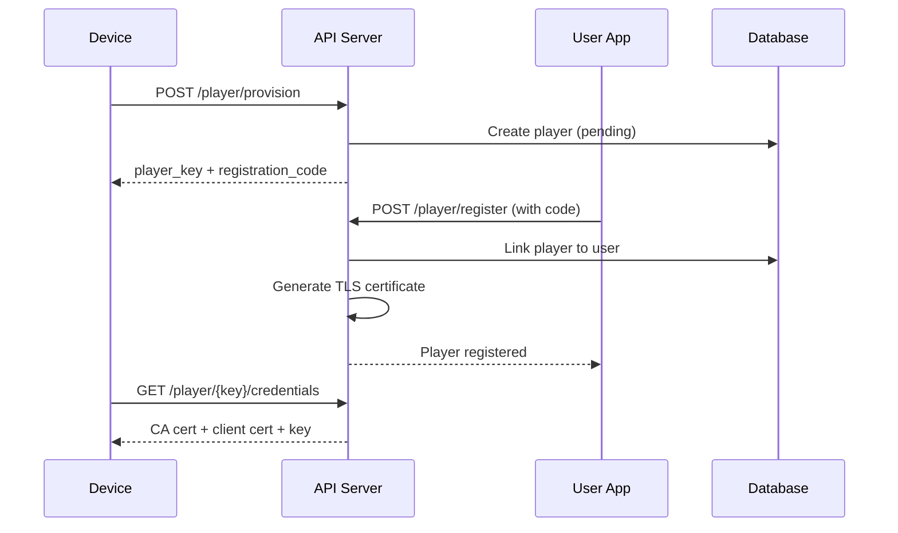

# MQTT/IoT Security Audit

## Overview

Makapix Club uses MQTT for communication with physical player devices (pixel art display devices). The system implements mTLS (mutual TLS) for device authentication.

---

## Positive Security Controls ✅

### 1. mTLS Authentication
**Status:** ✅ Good

**Location:** `mqtt/mosquitto.conf:13-23`

```conf
# mTLS listener on port 8883 (for physical player devices)
listener 8883 0.0.0.0
cafile /mosquitto/certs/ca.crt
certfile /mosquitto/certs/server.crt
keyfile /mosquitto/certs/server.key
require_certificate true
use_identity_as_username true
tls_version tlsv1.2
crlfile /mosquitto/certs/crl.pem
```

**Findings:**
- Client certificates required for device connections
- Certificate CN used as username (use_identity_as_username)
- TLS 1.2 minimum enforced
- Certificate Revocation List (CRL) support enabled

### 2. Certificate Generation
**Status:** ✅ Good

**Location:** `api/app/mqtt/cert_generator.py`

**Findings:**
- RSA 2048-bit keys for client certificates
- 365-day validity (appropriate for IoT devices)
- Serial numbers tracked for revocation
- Client CN matches player_key UUID

### 3. Certificate Revocation on Device Deletion
**Status:** ✅ Good

**Location:** `api/app/routers/player.py:491-512`

```python
# Revoke TLS certificate to prevent reconnection via mTLS
if cert_serial:
    revoked = revoke_certificate(
        serial_number=cert_serial,
        ca_cert_path=ca_cert_path,
        ca_key_path=ca_key_path,
        crl_path=crl_path,
    )
```

**Findings:**
- Certificates revoked when devices are deleted
- CRL updated automatically
- MQTT client disconnected after revocation

### 4. Anonymous Access Disabled
**Status:** ✅ Good

**Location:** `mqtt/mosquitto.conf:2-4`

```conf
allow_anonymous false
acl_file /mosquitto/config/acls
password_file /mosquitto/config/passwords
```

**Findings:**
- Anonymous connections rejected
- ACL file controls topic access
- Password file for internal API access

### 5. Command Rate Limiting
**Status:** ✅ Good

**Location:** `api/app/routers/player.py:564-580`

```python
# Check rate limits
player_key = f"ratelimit:player:{player_id}:cmd"
user_key = f"ratelimit:user:{user.id}:cmd"

allowed_player, remaining_player = check_rate_limit(player_key, limit=300, window_seconds=60)
allowed_user, remaining_user = check_rate_limit(user_key, limit=1000, window_seconds=60)
```

**Findings:**
- Per-player rate limit: 300 commands/minute
- Per-user rate limit: 1000 commands/minute
- Prevents command flooding

### 6. View Event Deduplication
**Status:** ✅ Good

**Location:** `api/app/services/rate_limit.py:130-168`

```python
def check_view_duplicate(player_key: str, post_id: int, timestamp: str) -> bool:
    # Uses Redis to track recent view events and prevent MQTT QoS 1 retransmissions
    dedup_key = f"view_dedup:{player_key}:{post_id}:{timestamp}"
```

**Findings:**
- MQTT QoS 1 retransmissions handled
- Deduplication window of 60 seconds
- Prevents inflated view counts

---

## Issues Identified

### WebSocket Listener Security
**Severity:** 🟡 MEDIUM

**Location:** `mqtt/mosquitto.conf:25-30`

**Issue:** The WebSocket listener (port 9001) uses password authentication rather than client certificates.

**Current Configuration:**
```conf
# WebSocket listener on port 9001 (for web clients - password auth)
listener 9001 0.0.0.0
protocol websockets
# WebSocket doesn't use client certs, so we'll use password auth
# Note: This is less secure but necessary for browser compatibility
```

**Risk Assessment:**
- WebSocket connections less secure than mTLS
- Password auth required for browser compatibility
- Mitigated by existing JWT authentication in web app

**Recommendation:**
1. Ensure WebSocket password is strong and rotated
2. Consider token-based auth for WebSocket (if MQTT broker supports)
3. Rate limit WebSocket connections

---

### Player Key as Authentication
**Severity:** 🟢 LOW

**Location:** `api/app/routers/player.py:266-316`

**Issue:** The player_key UUID is used as the sole authentication for credential retrieval. While UUIDs provide 122 bits of entropy, a brute force attempt is theoretically possible.

**Current Flow:**
```
Device -> /player/provision -> player_key + registration_code
User -> /player/register -> links player to account
Device -> /player/{player_key}/credentials -> returns TLS certs
```

**Mitigation Factors:**
- UUID v4 provides 122 bits of entropy (2^122 combinations)
- Rate limiting recommended (see API Security audit)
- Certificates can be revoked if compromised

---

## MQTT Topic Security

### Topic ACL Structure

**Expected ACL Pattern:**
```
# Player can subscribe to their command topic
user {player_key}
topic read player/{player_key}/command

# Player can publish to their status topic  
user {player_key}
topic write player/{player_key}/status

# Player can publish view events
user {player_key}
topic write player/{player_key}/view
```

**Recommendation:** Verify ACL file enforces:
1. Players can only access their own topics
2. Internal API has appropriate publish/subscribe permissions
3. No wildcard subscriptions allowed for players

---

## Device Lifecycle Security

### Registration Flow


### Security Controls at Each Step

| Step | Control |
|------|---------|
| Provision | 6-char code expires in 15 minutes |
| Register (code validation) | Requires authenticated user, max 128 players per user |
| Register (cert generation) | TLS certificate generated and stored |
| Get Creds | player_key UUID required |
| Connect | mTLS certificate required |
| Delete | Certificate revoked via CRL |

---

## Certificate Management

### Current Implementation
**Status:** ✅ Good

- Certificates stored in database (encrypted at rest recommended)
- 365-day validity period
- 30-day renewal threshold
- Serial numbers tracked for revocation
- CRL updated on revocation

### Recommendations

1. **Certificate Storage:** Ensure database encryption at rest
2. **Key Rotation:** Consider CA key rotation procedure
3. **Renewal Alerts:** Alert users before certificate expiry
4. **Backup:** Backup CA certificate and key securely

---

## Audit Logging

### Command Logging
**Status:** ✅ Good

```python
# api/app/mqtt/player_commands.py
log_command(
    db=db,
    player_id=player.id,
    command_type="add_device",
    payload={
        "player_key": str(player.player_key),
        "owner_id": str(current_user.id),
        "device_name": player.name,
        ...
    },
)
```

**Logged Events:**
- add_device (registration)
- remove_device (deletion)
- show_artwork
- play_channel
- Other commands

---

## Recommendations Summary

| Priority | Action |
|----------|--------|
| Pre-Launch | Verify MQTT ACL configuration |
| Pre-Launch | Ensure WebSocket password is strong |
| Post-Launch | Add rate limiting to credential endpoint |
| Post-Launch | Implement certificate expiry notifications |
| Post-Launch | Consider WebSocket token authentication |
