# New-Post Flow — UI/UX Appraisal

**Date:** 2026-08-19 · **Scope:** `/submit` page (pre-post form + post-upload success state), `PostReviewNotice`, and the global style tokens they inherit. **Status: appraisal only — nothing implemented.**

**Target aesthetic (owner decision):** clean modern minimal — neutral, professional product chrome; the artwork provides the personality.

**Method:** full code read of `web/src/pages/submit.tsx` (1,488 lines), `web/src/components/PostReviewNotice.tsx`, `web/src/styles/globals.css`, plus 12 live screenshots of the dev site (desktop 1440px + mobile 390px, every flow state) captured via Playwright with stubbed API responses (no dev-DB writes). Screenshots are in `images/`; a few full-page captures show the fixed header drawn mid-page — that is a screenshot artifact, not a rendering bug.

---

## Verdict

The suspicion is confirmed on both counts.

**(a) AI telltales are present and loud.** The page carries nearly the complete 2024–25 "AI-generated UI" signature set: emoji used as iconography (📁 🚀 ❌ ⚠️ 🛡️ ⏳ ✅ 🔗), a gradient underline bar beneath the page title, cyan→pink/purple gradients on every emphatic element (buttons, slider thumb, progress bar, icon disc), neon glow hover shadows, `translateY(-1px)` button lifts, and exclamation-mark copy ("Artwork Uploaded!"). Any one of these is defensible; together they read as template output rather than design decisions.

**(b) The result is below professional bar** — not because it's ugly in isolation, but because it lacks a system: four accent colors distributed without meaning, two different gradients competing for "primary action," a red link that looks like an error before the user has done anything, monospace used as decoration, and a success screen whose two buttons have identical visual weight.

The good news: the *bones are strong*. The two-column layout, the draft persistence, the scaling/preview machinery, the review-status messaging (new-post-ux effort), and the license picker are genuinely better than what most small art communities ship. This is a skin problem, not a structure problem — most fixes are CSS-level and low-risk.

One strategic tension to resolve first, though: **the site-wide theme itself** (pure-black background + neon cyan/pink/purple, `globals.css` line 2: "Dark theme with neon accents") is partly at odds with "clean modern minimal." The findings below assume the chosen direction; F1 addresses the tension head-on.

---

## Strategic finding

### F1. The token palette drives the "AI look" more than any single page — decide the theme once, then everything else follows

**Evidence:** `globals.css` defines four neon accents (`--accent-pink #ff6eb4`, `--accent-cyan #00d4ff`, `--accent-purple #b44eff`, `--accent-blue #4e9fff`) plus three glow shadows, on a pure `#000000` background. The submit page then uses *all of them at once* (screenshots 01–04): cyan section headers, pink section headers, cyan→purple Submit, cyan→pink Preview Scaling, gradient slider thumb, gradient progress bar.

**Why it matters:** "Clean modern minimal" is fundamentally a *restraint* system: one accent, semantic colors for state, neutral everything else. No amount of per-page cleanup will land while the token layer hands every component four neons and a glow.

**Proposal (pick one):**
- **P1-a (recommended for the chosen direction):** Soften the base and collapse the accents. Background ramp off pure black (e.g. `#0e0f13 / #16171d / #1e2028` — pure black + neon is the vaporwave signature), keep **one** brand accent (cyan is the natural survivor; it's in the logo treatment) for interactive elements, and add semantic tokens (`--danger`, `--warning`, `--success`) for state. Pink/purple survive only inside artwork frames and the logo. This is a ~30-line `globals.css` change with site-wide effect.
- **P1-b:** Keep the neon identity deliberately (it *is* defensible for a pixel-art community) but enforce usage rules: neon only on interactive/hover states, never on static text like section headers, never two gradients on one screen. This keeps the brand but still kills the chaos.

Everything below is written to work under either choice.

---

## Findings — AI telltales

### F2. Emoji as UI iconography (highest-impact single fix)

**Evidence:** 📁 in the dropzone disc (01), 🚀 inside the primary **Submit** button (01, 02), ❌ error boxes, ⚠️ warnings (09), and in `PostReviewNotice`: 🛡️ (07), ⏳ (08/12), ✅ (06), 🔗 Copy link (08). Meanwhile the **site header uses custom pixel-art icon images** (`public/button/…`) — the site already owns an icon language that the submit flow ignores.

**Why it matters:** Emoji render differently on every OS, can't be recolored or weighted, and are the single most recognizable "AI built this" marker. The 🚀 in the primary CTA is the loudest offender on the page.

**Proposal:** Remove every emoji from chrome. Text-only is already an upgrade (`Submit`, `Copy link`). Where an icon earns its place (dropzone, notice types), use one consistent set — either small inline SVGs (Lucide/Heroicons, 1.5px stroke, `currentColor`) for the clean-minimal direction, or commissioned pixel-art glyphs matching the header buttons if P1-b is chosen. Never mix the two.

### F3. Gradient-everything, and two *different* gradients for primary actions

**Evidence:** Title underline bar cyan→pink (01); upload icon disc cyan→pink (01); Submit button cyan→**purple** (01); Preview Scaling button cyan→**pink**, full-width (04, 09); slider thumb gradient (04); progress fill gradient; success-screen buttons gradient (06).

**Why it matters:** The 80px gradient bar under an H1 is the canonical AI-template flourish. Worse, gradients are inconsistent: on screenshot 09 the secondary action "Preview Scaling" is visually *louder* (cyan→pink, full width) than Submit itself. Gradients also break disabled states — the disabled Submit is a dimmed rainbow (05).

**Proposal:** One solid accent fill for the single primary action per screen; quiet outline/ghost style for everything else. Delete the title underline (an H1 with correct size/weight needs no decoration). Slider thumb, progress bar, icon disc: solid accent. Total gradients in the flow after fix: zero (P1-a) or one, reserved for the brand logo (P1-b).

### F4. Neon glow hovers and button lift

**Evidence:** `.btn-primary:hover { box-shadow: var(--glow-cyan); transform: translateY(-1px) }`, `.preview-scaling-btn:hover { box-shadow: 0 0 20px rgba(0,212,255,.4) }` (`submit.tsx` ~1408–1448).

**Proposal:** Hover = slight brightness/background shift (`filter: brightness(1.1)` or one-step token change) and nothing moves. Reserve elevation/shadow for genuinely floating surfaces (the dialog).

### F5. Template copywriting

**Evidence:** "Artwork Uploaded!" (06); "Drop your artwork here / or click to browse"; placeholders that restate labels ("Enter artwork title..." under *Artwork Title*, "Describe your artwork..." under *Description*); "🚀 Submit".

**Proposal:** Calm, specific microcopy: success heading "Your artwork is posted" / pending "Posted — awaiting review" (drops the exclamation and does double duty with the status notice, see F12). Placeholders should add information or be empty — e.g. title placeholder can show the filename-derived default; description placeholder dropped; hashtags placeholder keeps its example (that one earns its place).

---

## Findings — hierarchy & professionalism

### F6. Color is distributed by mood, not meaning

**Evidence (01, 02):** Section headers alternate cyan ("Artwork Information", "Image Scaling", "License") and pink ("Upload Options") arbitrarily. Links come in cyan ("See size rules") and **red** ("See mandatory monitored hashtags rules") — red text on a pristine form reads as a validation error the user hasn't earned yet. License identifiers are cyan; info values white; highlighted output size pink (09).

**Proposal:** Section headers become neutral `--text-primary` at a consistent size/weight — hierarchy from typography, not hue. One link color site-wide. Color only ever encodes state: accent = interactive, amber = warning, red = error/destructive, green = success. The monitored-hashtags link loses red (see F8).

### F7. Empty state is badly imbalanced on desktop

**Evidence (01, 07):** Before a file is chosen, the right column presents the full metadata form (title, description, hashtags, two accordions, options card, Submit) for a post that doesn't exist, while the left column is a dropzone floating over a large black void. The eye has nowhere to start; Submit is visible but can't work.

**Proposal:** Stage the flow. Option A (minimal change): keep the grid but render the right column disabled/dimmed until a file is selected — the dropzone becomes the unambiguous first act. Option B (better): empty state is a single centered dropzone (with the format/size caption and rule links tucked beneath it); the two-column editor appears only after a file loads. B also fixes mobile, where today the user scrolls past ~1,300px of empty form (10) before realizing nothing works without a file.

### F8. The floating rule links look tacked on — because they are

**Evidence (01):** Two center-aligned bare links stacked under the dropzone: "See size rules" (cyan) and "See mandatory monitored hashtags rules" (red — see F6; also a four-noun pile-up).

**Proposal:** Contextualize them. Size rules: one short line inside the dropzone caption ("PNG, GIF, WebP, BMP · max 5 MiB · [size rules]"). Hashtag rules: helper text under the *Hashtags* field ("Some tags are moderated — [tag rules]"), which is where the user is when the rule matters. Neutral link color, sentence-case wording.

### F9. The dropzone keeps its dashed "empty" costume after the image loads

**Evidence (02, 03):** The loaded preview sits inside the same dashed marching-ants border, still click-to-replace everywhere, with a "✕ Remove" button floating inside the clickable zone (works only via `stopPropagation`). Dashed borders are drag-target affordances; keeping one around finished content looks unfinished and makes misclick-replace easy.

**Proposal:** After load, swap to a solid card: preview on the checker/neutral well, filename + dimensions caption, and a small "Replace / Remove" action row *outside* the click target. Dashed border exists only in the empty state (and as a drag-over highlight).

### F10. Two primary buttons everywhere — no action has priority

**Evidence:** Form: gradient **Submit** next to outline Clear All — fine — but the *scaling section* injects a full-width louder gradient (09). Success screen (06, 08, 12): "View Artwork" and "Upload Another" are byte-identical `.btn-primary` gradients — literally the same class in code (`submit.tsx:915-916`).

**Proposal:** One primary per screen, everything else secondary/ghost. Success screen: **View artwork** = primary (it's the natural next step and the emotional payoff), "Upload another" = quiet text/outline button. Preview Scaling = normal secondary width-auto button.

### F11. Success screen details undercut the moment

**Evidence (06):** Heading "Artwork Uploaded!"; timestamp rendered as `8/19/2026, 4:06:24 PM` (raw `toLocaleString()` — seconds precision, locale-dependent slashes); the H1 "Upload Artwork" still sits above a card announcing the upload is done; approved users get a full green notice box restating what the heading already said; there's no share affordance for approved posts (pending gets Copy link, approved gets nothing — backwards: approved posts are the most shareable).

**Proposal:** Treat it as a moment of celebration with a clear hierarchy: artwork large on the neutral well, **title as the card heading** ("Old Chief"), status as one quiet line or small badge ("Live now" / "Awaiting review — visible on your profile"), relative time ("just now") or no timestamp at all, **Copy link available in both variants**, primary View artwork + secondary Upload another (F10). The pending variant keeps its explanatory paragraph (it earns the space); the approved variant needs one line, not a notice box.

### F12. `PostReviewNotice` styling: warning-yellow for a neutral fact, hover that changes color identity

**Evidence (07, 08, 12):** The pending/pre-upload notice uses amber warning styling for what is actually neutral process information (the new-post-ux copy itself is good and honest). Its "Copy link" button is amber-bordered but turns cyan on hover. The pre-upload variant occupies the full content width above the form (07), giving a brand-new user a caution banner as their first impression.

**Proposal:** Restyle as neutral-informational (subtle border, no fill, or accent-tinted at low alpha); reserve amber for things that can go wrong. Keep one consistent color identity per control across states. Pre-upload variant can compress to one line + expandable detail ("Posts from new members are reviewed before public release · How it works").

### F13. Engineer-speak leaks into user-facing controls

**Evidence (04, 09):** Radio options "Nearest Neighbor (NN)" / "Lanczos3 (LZ3)" with mono font; boxes reading `No scaling applied` and `Output: 64 × 64 px (64.0%)` in terminal-style mono chips; "Upload max 5 MiB (loadable up to 256 MiB for resizing)"; info card shows "Frame Rate: N/A" for static images; scaling slider bottoms out at "3.125%".

**Proposal:** Plain-language first, jargon in parentheses only when it helps: "**Crisp** — best for pixel art (nearest neighbor)" / "**Smooth** — best for photos (Lanczos)". Kill the mono-chip styling for prose-like feedback; mono is fine for dimension *values*. Info card: hide N/A rows; a static image reads "PNG · 64 × 64 · static" on one line (the four-cell grid with "Frames: 1 / Frame Rate: N/A" is filler). MiB → MB in user copy (keep MiB math internally).

### F14. Form-noise: always-on character counters, unexplained asterisk

**Evidence (01):** "0/128" and "0/5000" visible on a pristine form; `*` on Artwork Title with no legend.

**Proposal:** Show counters only while the field is focused or above ~80% of limit. Replace `*` with the word "required" in the label's helper style, or mark the *optional* fields instead ("Description — optional") since only title is required.

### F15. Accordions behave inconsistently and use text-glyph arrows

**Evidence (01, 02):** License shows its selection as a chip when collapsed ("No License"); Image Scaling shows nothing when collapsed even when a rescale is set (the one piece of state the user must not forget at submit time). Arrows are `▲▼` text glyphs in a different visual language from everything else. Section titles in accent cyan (F6).

**Proposal:** Both accordions summarize their state when collapsed ("Image Scaling · 64 × 64 (from 100 × 100)"). One chevron SVG, rotating. Neutral title color. (There's a `components/ui/accordion.tsx` — fold this into a shared component instead of the page-local rebuild.)

### F16. "Upload Options" card is a heading in search of content

**Evidence (01):** A dedicated card with a pink section header for exactly two checkboxes.

**Proposal:** Drop the card and header; the two options live as plain checkboxes at the end of the form (or "Post as hidden" becomes a Visibility select: Public / Hidden). The Remixable checkbox with its inline explanation is good — keep the pattern.

### F17. Naming drift: Upload vs Submit vs Post

**Evidence:** Route `/submit`, `<title>Submit Artwork</title>`, H1 "Upload Artwork", button "🚀 Submit", success "Artwork Uploaded!", nav concept "new post".

**Proposal:** Pick one verb — **Post** is the social-network-native choice ("New post" H1, "Post" button, "Your artwork is posted"). "Upload" describes the mechanism, not the act; "Submit" sounds like a form at the DMV.

### F18. Monolith page + orphaned primitives (maintainability, enables all of the above)

**Evidence:** `submit.tsx` is 1,488 lines with ~170 lines of page-local styled-jsx that hand-rolls `.btn`, `.form-input`, `.accordion`, `.toggle`, `.dialog` — all primitives that any redesign would touch on every other page too. `components/ui/` exists but contains only `accordion.tsx`, which this page doesn't use.

**Proposal:** As part of (not before) the visual pass, extract Button, Input/Textarea/Field (label + control + helper + counter), Accordion, Notice/Callout, and Dialog into `components/ui/`. Then the F1 token decision propagates for free, and future pages can't fork the styles again. The recharts metrics kit (PR #255/#256) already proved this extraction pattern works in this codebase.

---

## Suggested sequencing (all pending owner approval)

| Phase | Contents | Effort | Impact |
|---|---|---|---|
| 1. Token reset | F1 (palette decision), F4 (kill glows) | ~1 day | site-wide |
| 2. De-AI the submit page | F2 (emoji→icons), F3 (gradients→solid), F5+F17 (copy), F6 (color discipline), F14 | ~1–2 days | the visible "AI smell" is gone |
| 3. Flow & hierarchy | F7 (staged empty state), F8, F9, F10, F11+F12 (success screen), F13, F15, F16 | ~2–3 days | professional feel |
| 4. Systemize | F18 (ui/ primitives) | alongside 2–3 | future-proofing |

Phases 1–2 alone would resolve suspicion (a) entirely and most of (b).

---

## Screenshot index

| # | State | File |
|---|---|---|
| 01 | Desktop, empty form, trusted user | `images/01-desktop-empty-trusted.png` |
| 02 | Desktop, file loaded + form filled | `images/02-desktop-filled.png` |
| 03 | Desktop, License accordion open | `images/03-desktop-license-open.png` |
| 04 | Desktop, Image Scaling accordion open | `images/04-desktop-scaling-open.png` |
| 05 | Desktop, Clear-all confirmation dialog | `images/05-desktop-clear-dialog.png` |
| 06 | Desktop, success — auto-approved | `images/06-desktop-success-approved.png` |
| 07 | Desktop, empty form, untrusted (pre-upload review notice) | `images/07-desktop-empty-untrusted.png` |
| 08 | Desktop, success — pending review + Copy link | `images/08-desktop-success-pending.png` |
| 09 | Desktop, non-standard 100×100 input forcing required scaling | `images/09-desktop-scaling-required.png` |
| 10 | Mobile 390px, empty form | `images/10-mobile-empty.png` |
| 11 | Mobile 390px, file loaded | `images/11-mobile-filled.png` |
| 12 | Mobile 390px, success — pending review | `images/12-mobile-success-pending.png` |

### 01 — Desktop, empty (trusted)
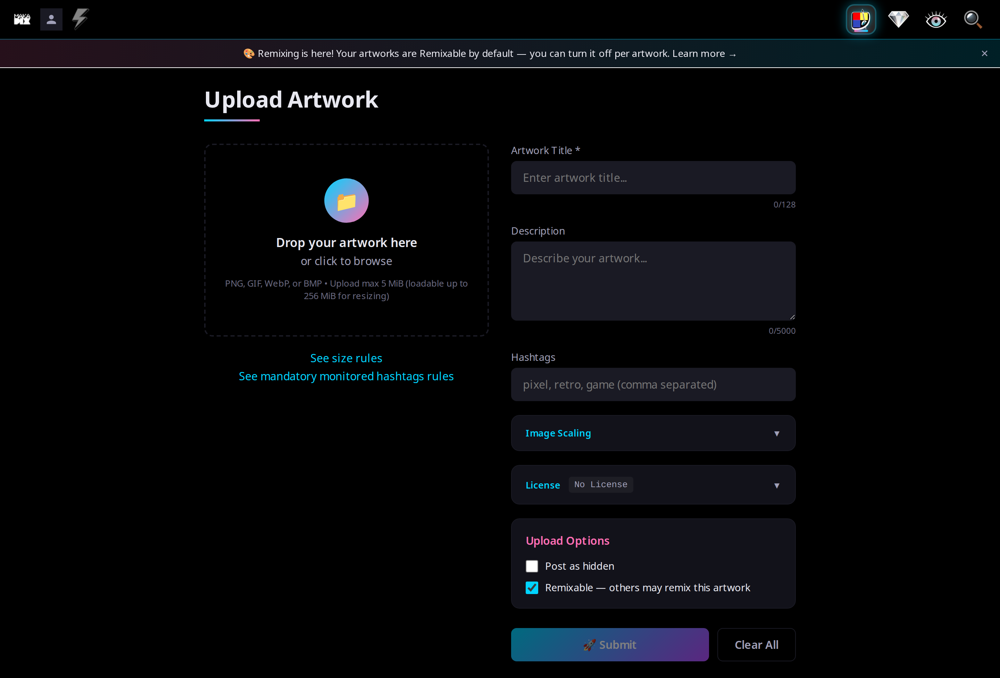

### 02 — Desktop, filled
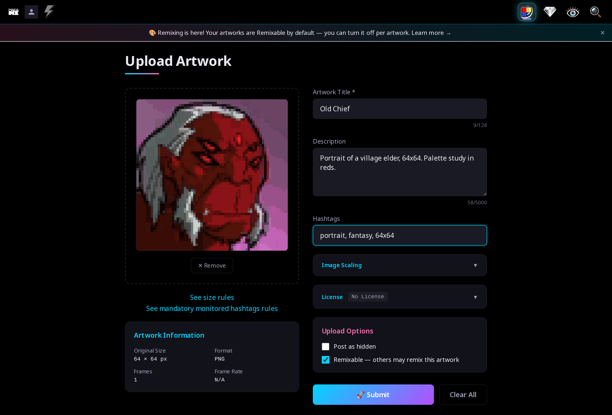

### 03 — Desktop, license open
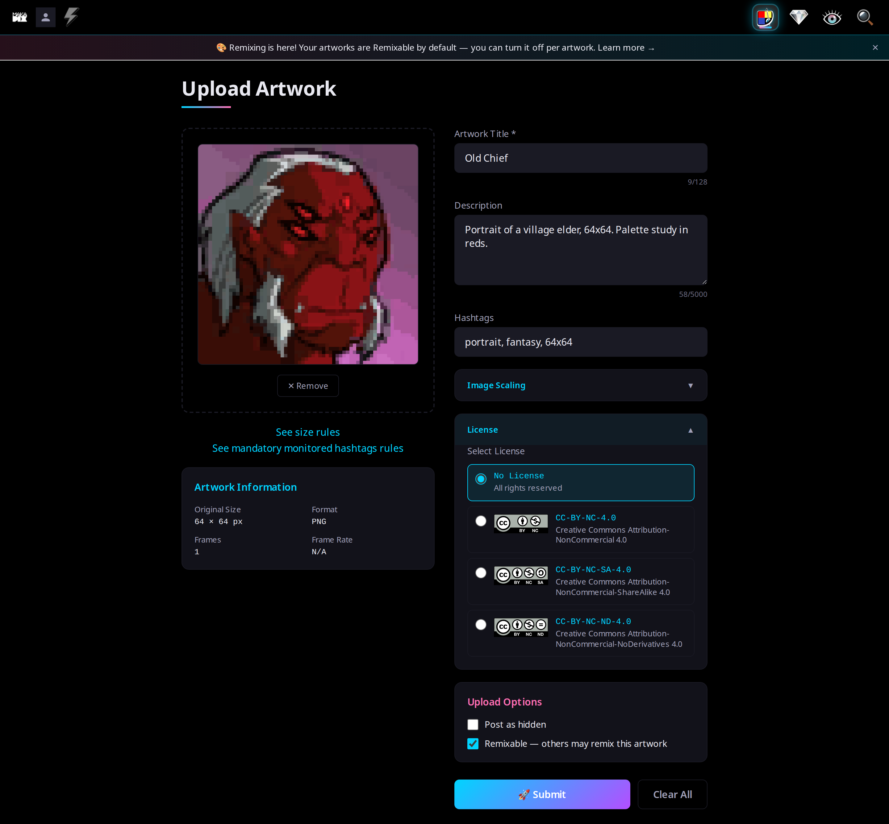

### 04 — Desktop, scaling open
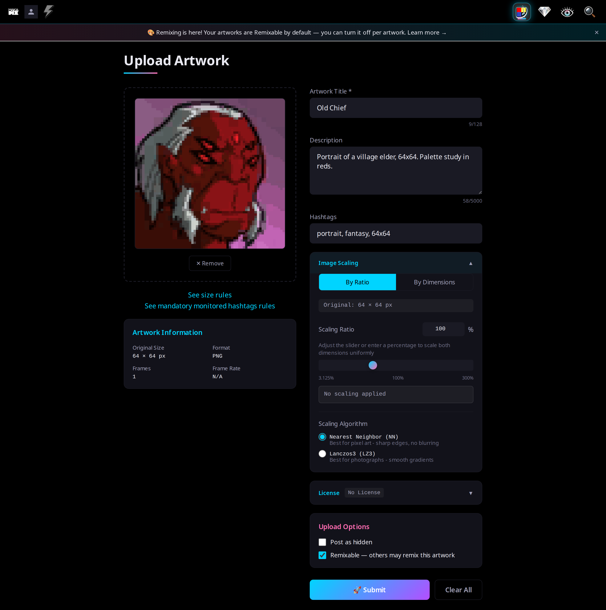

### 05 — Desktop, clear-all dialog
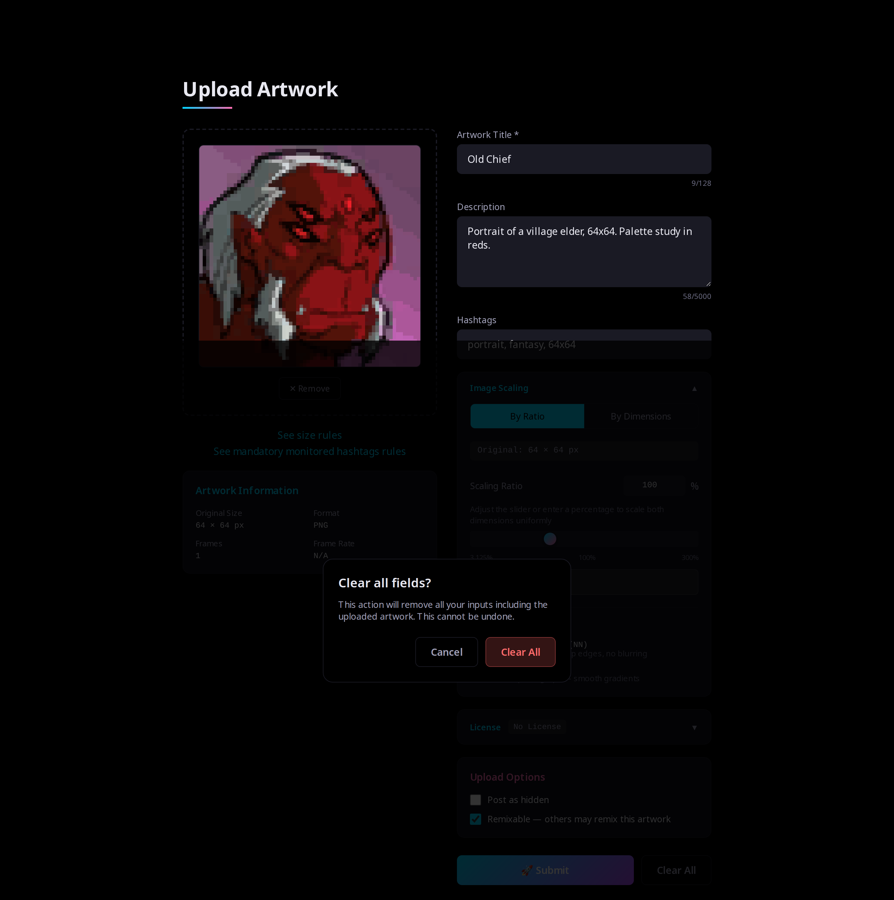

### 06 — Desktop, success (approved)
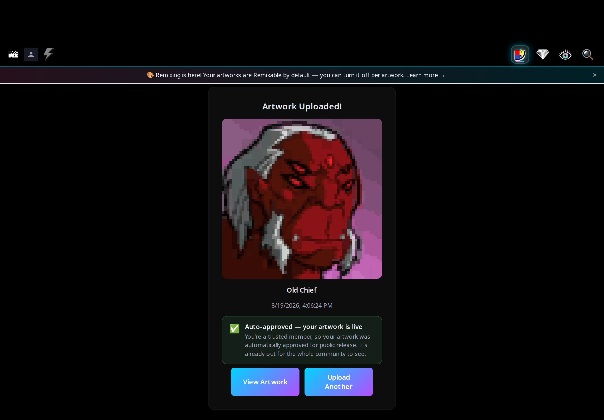

### 07 — Desktop, empty (untrusted)
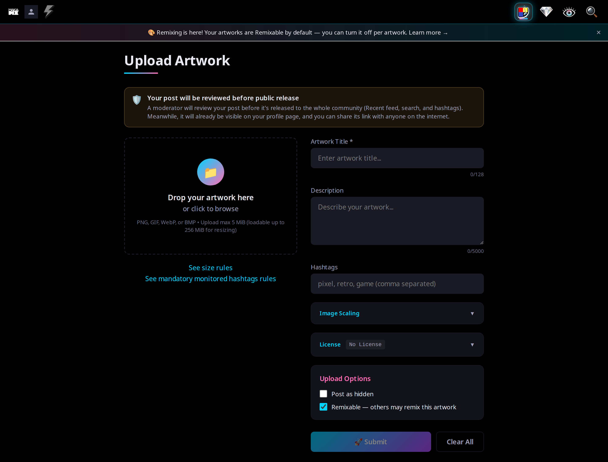

### 08 — Desktop, success (pending)
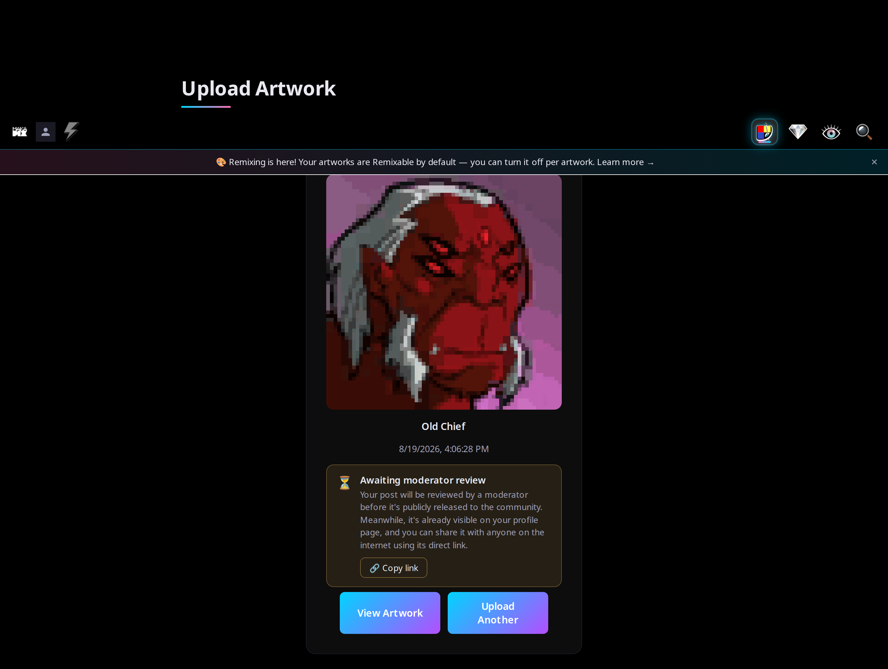

### 09 — Desktop, scaling required (100×100 input)
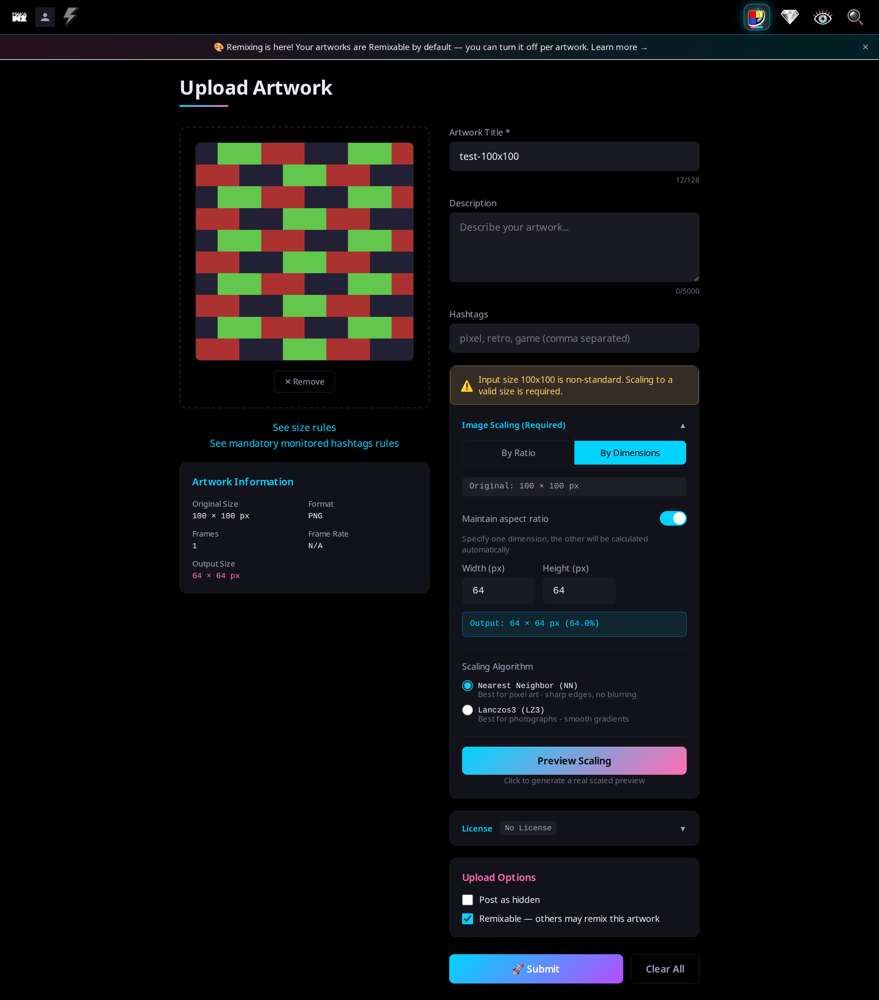

### 10 — Mobile, empty
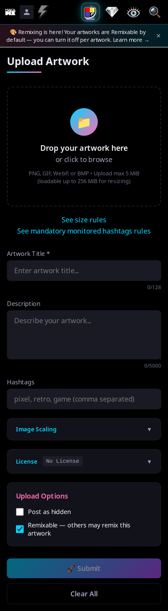

### 11 — Mobile, filled
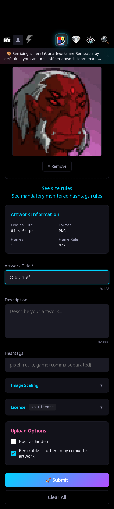

### 12 — Mobile, success (pending)
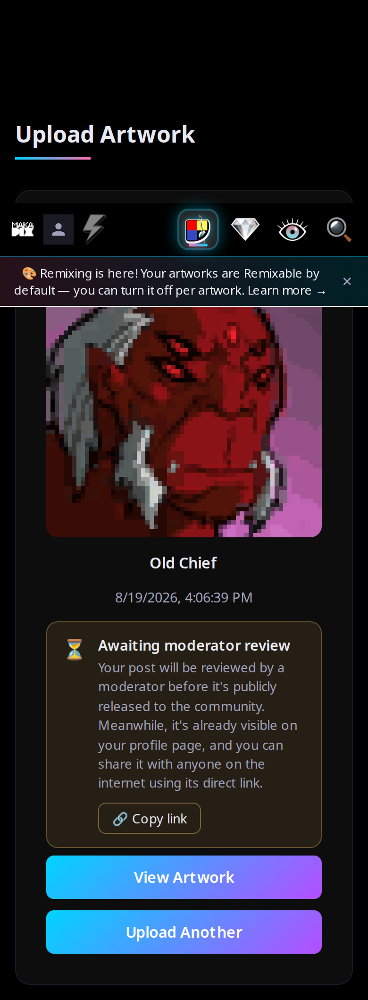
