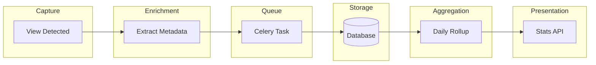
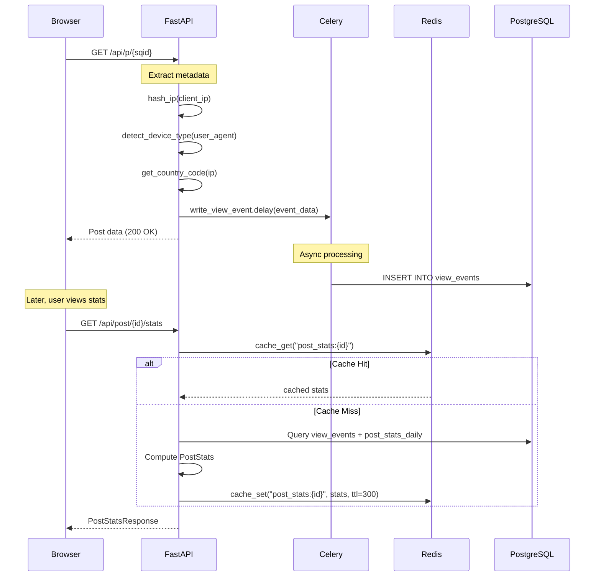
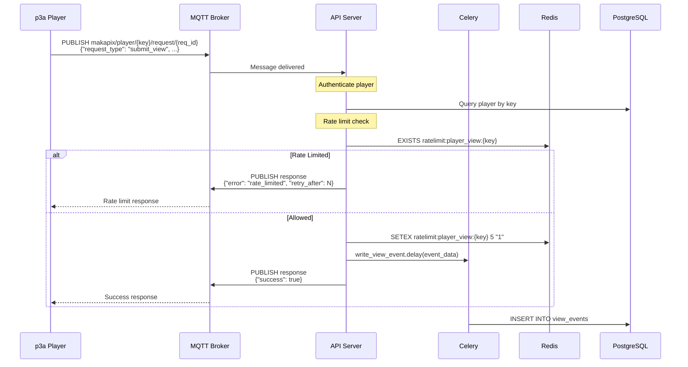
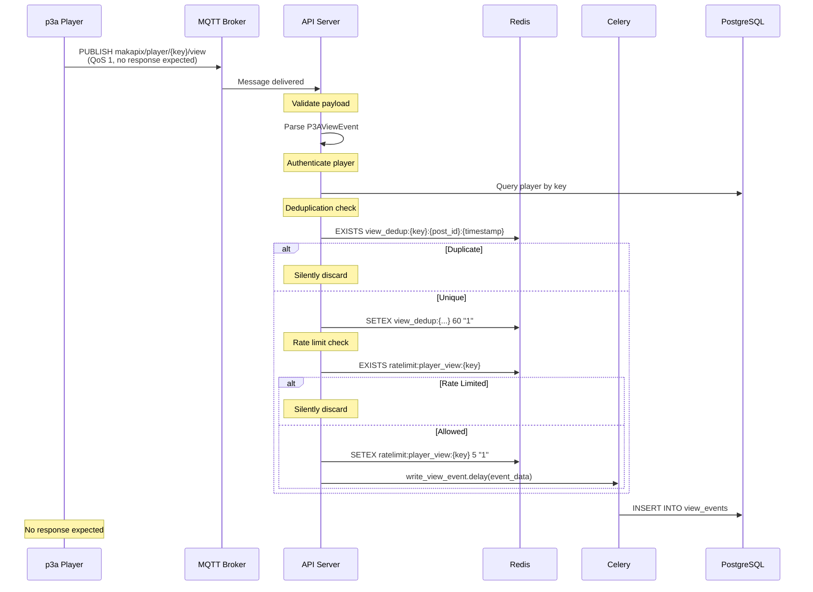
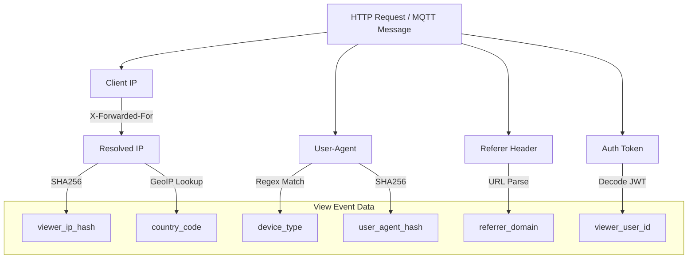
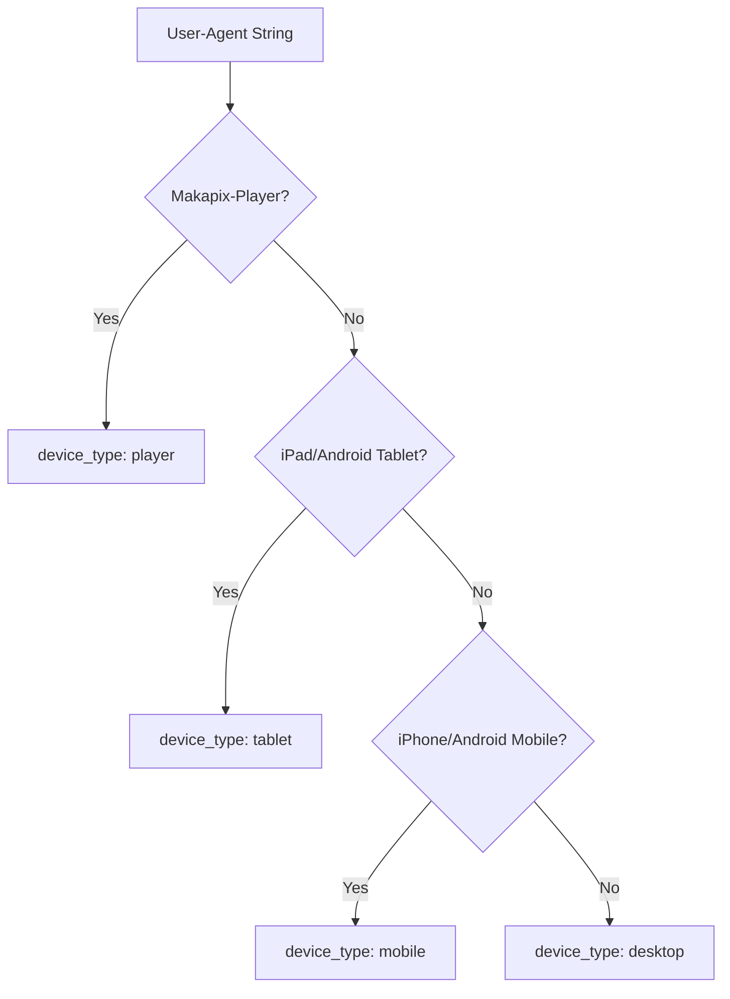
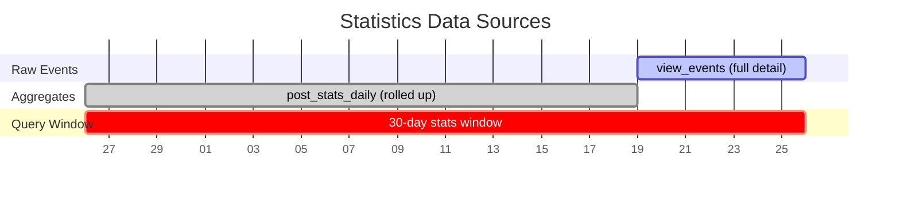
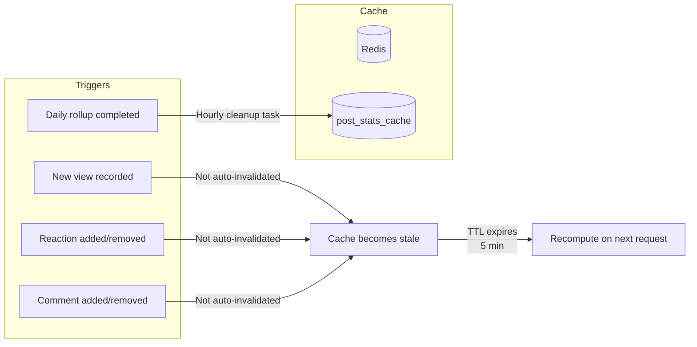
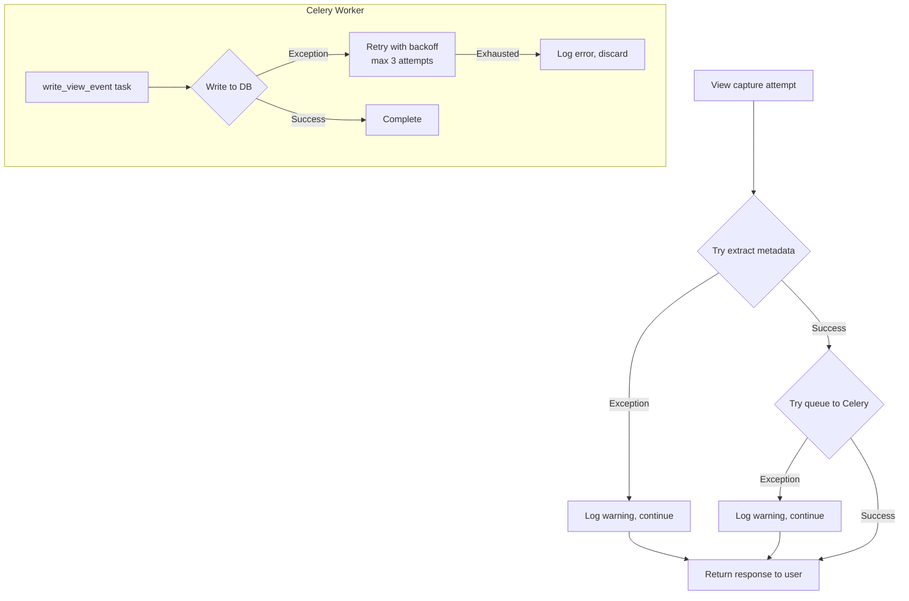

# VTS Data Flow

This document describes the end-to-end flow of view data through the View Tracking System, from initial capture to final presentation.

## High-Level Flow



## Detailed Flow by Source

### Web Browser Flow



### Player Flow (Request/Response Pattern)



### Player Flow (Fire-and-Forget Pattern)



## Metadata Extraction

When a view is captured, the following metadata is extracted:



### Device Detection Logic



## Daily Aggregation Flow

The daily rollup task runs once per day to aggregate old view events:

```mermaid
flowchart TD
    START[Celery Beat: rollup_view_events]
    
    START --> CUTOFF[Calculate cutoff: now - 7 days]
    CUTOFF --> COUNT[Count events older than cutoff]
    
    COUNT --> CHECK{Events > 0?}
    CHECK -->|No| DONE[Done - nothing to process]
    
    CHECK -->|Yes| BATCH[Process in batches of 10,000]
    
    BATCH --> AGG[Aggregate by post_id + date]
    
    subgraph Aggregation
        AGG --> TV[total_views++]
        AGG --> UV[unique IP hashes → set]
        AGG --> BC[views_by_country map]
        AGG --> BD[views_by_device map]
        AGG --> BT[views_by_type map]
    end
    
    AGG --> UPSERT{Record exists?}
    UPSERT -->|Yes| MERGE[Merge with existing]
    UPSERT -->|No| INSERT[Insert new record]
    
    MERGE --> DELETE[Delete old raw events]
    INSERT --> DELETE
    
    DELETE --> DONE2[Done]
```



## Statistics Computation Flow

On-demand statistics are computed by combining recent raw events with historical daily aggregates:

```mermaid
flowchart TD
    REQ[GET /api/post/{id}/stats]
    
    REQ --> AUTH[Verify authorization]
    AUTH --> CACHE{Redis cache hit?}
    
    CACHE -->|Yes| RETURN[Return cached stats]
    
    CACHE -->|No| COMPUTE[Compute fresh stats]
    
    subgraph Computation["Stats Computation"]
        COMPUTE --> RECENT[Query view_events<br/>last 7 days]
        COMPUTE --> DAILY[Query post_stats_daily<br/>days 8-30]
        
        RECENT --> COMBINE[Combine data sources]
        DAILY --> COMBINE
        
        COMBINE --> CALC_ALL[Calculate "all" stats]
        COMBINE --> CALC_AUTH[Calculate "authenticated" stats]
        
        CALC_ALL --> BUILD[Build PostStats object]
        CALC_AUTH --> BUILD
    end
    
    BUILD --> CACHE_SET[Cache in Redis<br/>TTL: 5 minutes]
    CACHE_SET --> RETURN
```

### Data Source Timeline



## Cache Invalidation

Stats cache is invalidated under these conditions:



> **Note:** The current implementation relies on cache TTL expiration rather than explicit invalidation when views are recorded. This means stats may be up to 5 minutes stale.

## Error Handling

View tracking is designed to be **fail-safe** and **non-blocking**:



---

*See also: [Sources and Channels](./sources-and-channels.md) for details on view sources*

