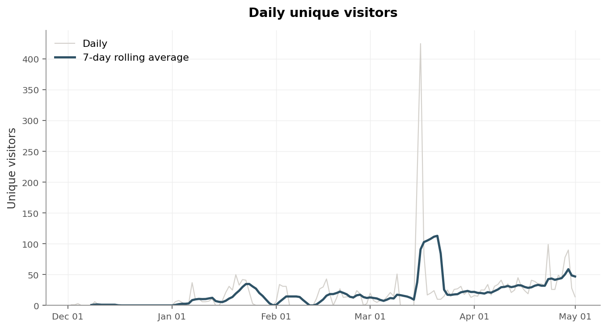
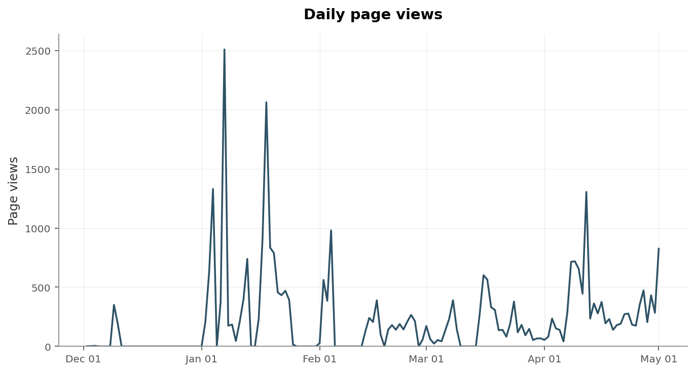
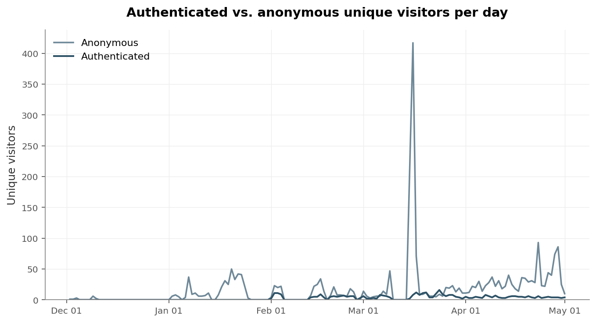
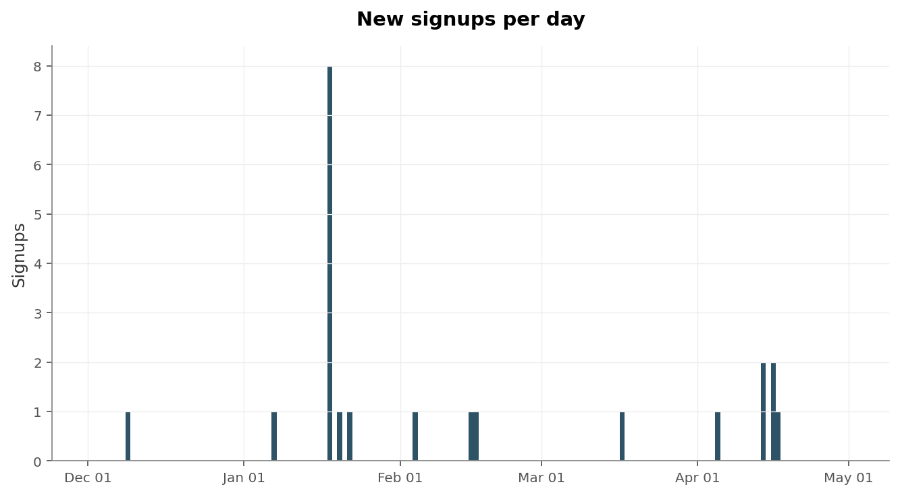
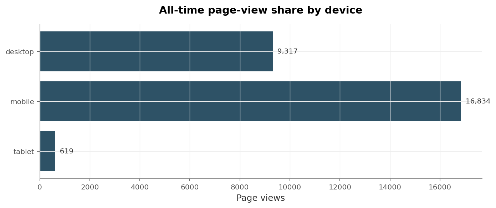
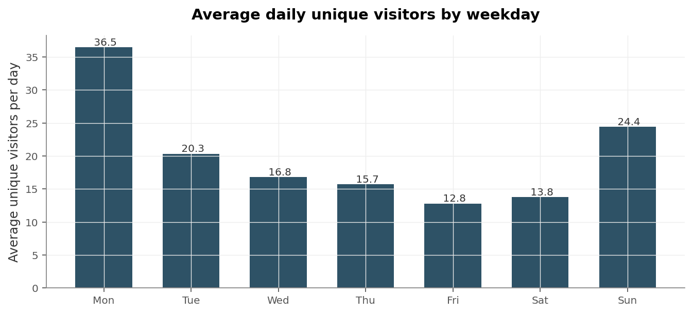

# Makapix Club — Visits History Report

**Period covered:** December 02, 2025 through May 01, 2026 (151 calendar days, 101 with non-zero traffic).

## Introduction

This report summarizes human web traffic to makapix.club from the site's earliest recorded day through the most recent fully-aggregated day. Data is drawn from the production `site_stats_daily` table.

Out of scope: views recorded by physical Pixelc players in the field, the May 2–8 trailing window (not yet rolled up), creator activity (posts, uploads), and operational metrics (errors, API calls). Geographic distribution is also omitted — country attribution from GeoIP is not currently captured at request time, so the dimension is empty in the data.

Across the period, the site logged **3,013 unique visitors** generating **34,001 page views**, with **22 new signups**.

---

## 1. Daily unique visitors

Daily counts (faint line) are noisy on a low-volume site; the 7-day rolling average (bold) smooths the trend. The window starts with single-digit days in early December and peaks at **425 unique visitors on March 16, 2026**.

---

## 2. Daily page views

Page views run roughly 10× the unique-visitor count, with notable spikes that don't always correspond to high-uniques days — suggesting periods of deeper engagement from a smaller audience. Peak: **2,508 page views on January 07, 2026**.

---

## 3. Authenticated vs. anonymous unique visitors

Anonymous traffic dominates the site. Across the full period, authenticated unique-visitor days totaled 417 (sum across days, with users counted once per day they visited).

---

## 4. New signups per day

Signups are sparse — 22 total over 151 days — and bursty rather than steady. Bars mark the days with at least one new account.

---

## 5. Page-view share by device

Page views (not unique visitors) attributed to each device class, summed across the full period. The schema records totals per device per day rather than unique-by-device counts, so the chart answers "what device was the traffic on" rather than "what device do the visitors use".

---

## 6. Weekly traffic pattern

Average unique visitors per weekday across the full period. The pattern reveals when the audience is most active — useful for timing posts and announcements.

---

## Closing observations

The visible patterns are the December cold start, a gradual ramp through the spring, and a persistent skew toward anonymous traffic. The March 16, 2026 visitor peak (425 uniques) and the January 07, 2026 page-view peak (2,508 views) sit on different days, hinting that occasional bursts of deep engagement are driven by a different signal than overall reach. The weekly pattern adds a third lens: weekday traffic is uneven, with Mondays and Sundays consistently busier than the mid-week trough.
